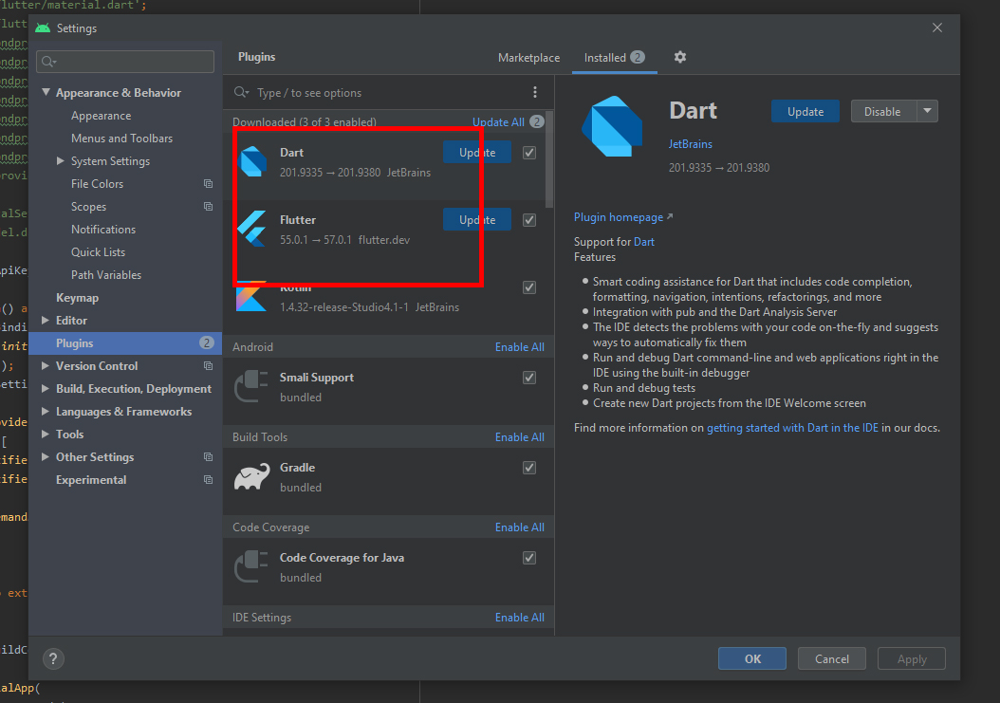
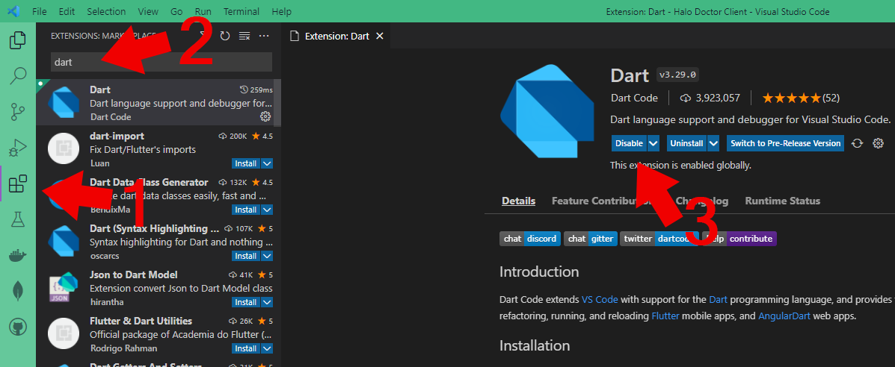
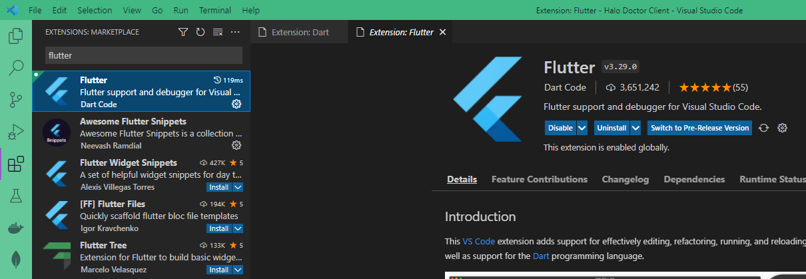

# Install Plugin

## Android Studio Plugin

In Android Studio Menu -> File -> Settings. Open 'Plugins'. Make sure that 'Dart' and 'Flutter' plugins are installed.

## Visual Studio Code Plugin

- In Visual Studio Code, Open Extension `CTRL+SHIT+Z`

- type `dart` in searchbox

- and install dart

and do the same thing with `flutter`

---
