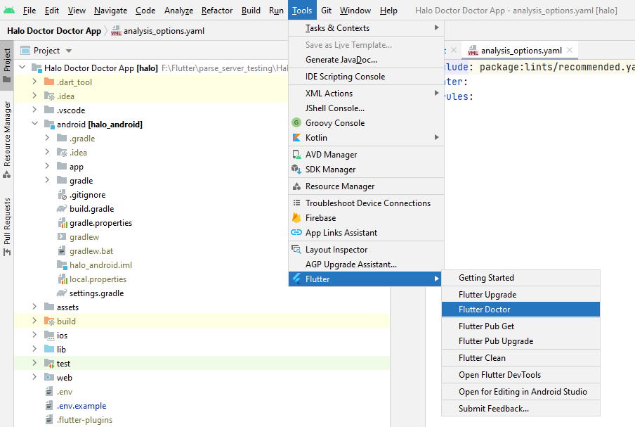
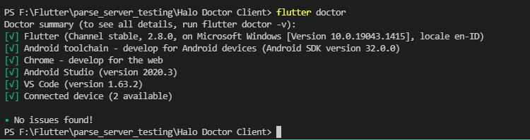

# Set up your Android device

For testing Video Call Functionality you need 2 device, if you only have one device, you can use one Emulator and one Real Android device, note that this app fully working on Android, for ios and Web not yet

To prepare to run and test your Flutter app on an Android device, you need an Android device running Android 4.1 (API level 16) or higher.

- Enable Developer options and USB debugging on your device. Detailed instructions are available in the Android documentation. https://developer.android.com/studio/debug/dev-options
- Windows-only: Install the Google USB Driver https://developer.android.com/studio/run/win-usb.
- Using a USB cable, plug your phone into your computer. If prompted on your device, authorize your computer to access your device.
- In the terminal, run the flutter devices command to verify that Flutter recognizes your connected Android device. By default, Flutter uses the version of the Android SDK where your adb tool is based. If you want Flutter to use a different installation of the Android SDK, you must set the ANDROID_SDK_ROOT environment variable to that installation directory.

## Set up the Android emulator

To prepare to run and test your Flutter app on the Android emulator, follow these steps:

- Enable VM acceleration on your machine. https://developer.android.com/studio/run/emulator-acceleration
- Launch Android Studio, click the AVD Manager icon, and select Create Virtual Device…
- In older versions of Android Studio, you should instead launch Android Studio > Tools > Android > AVD Manager and select Create Virtual Device…. (The Android submenu is only present when inside an Android project.)
- If you do not have a project open, you can choose Configure > AVD Manager and select Create Virtual Device…
- Choose a device definition and select Next.
- Select one or more system images for the Android versions you want to emulate, and select Next. An x86 or x86_64 image is recommended.
- Under Emulated Performance, select Hardware - GLES 2.0 to enable hardware acceleration. https://developer.android.com/studio/run/emulator-acceleration
- Verify the AVD configuration is correct, and select Finish.

For details on the above steps, see Managing AVDs. https://developer.android.com/studio/run/managing-avds

- In Android Virtual Device Manager, click Run in the toolbar. The emulator starts up and displays the default canvas for your selected OS version and device.

## Run flutter Teacher

In Android Studio Menu -> Tools -> Flutter -> Flutter Teacher



This command checks your environment and displays a report of the status of your Flutter installation. Check the output carefully for other software you might need to install or further tasks to perform (shown in bold text).

```
C:\Users\Amsyari\src\flutter\bin\flutter.bat Teacher --verbose
[√] Flutter (Channel stable, 2.8.0, on Microsoft Windows [Version 10.0.19043.1415], locale en-ID)
    • Flutter version 2.8.0 at C:\Users\Amsyari\src\flutter
    • Upstream repository https://github.com/flutter/flutter.git
    • Framework revision cf44000065 (2 weeks ago), 2021-12-08 14:06:50 -0800
    • Engine revision 40a99c5951
    • Dart version 2.15.0

....

• No issues found!
Process finished with exit code 0
```

### Flutter Teacher in Visual Studio Code

Open terimnal in Visual Studio code with `` CTRL + `  ``

and type

```jsx
flutter Teacher
```


