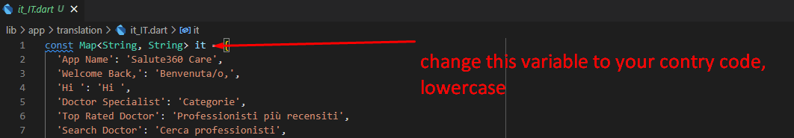

# Change App Language

1. To change the app language, you need to copy and paste the file `lib/app/translations/en_US.dart`
2. change that file name base on your country language, and make sure you name the file correctly first name is small language code 
   you can fined it here <https://docs.oracle.com/cd/E13214_01/wli/docs92/xref/xqisocodes.html>
   with and continue with `underscore` and capital country code, example for italia language : `it_IT.dart` file
3. after that, open that file and you need to translate the second part of the file example in english : `'Hallo': 'Hallo'` -> become spanish `'Hallo': 'Hola'`
4. don't forget to change the variable name to your country code
   
5. after you translate all of the text, you need to open file `lib/app/utils/localization.dart`, and import your file here, follow the image
   
6. Done, when you run the app your translation should be implemented

:::info
if you wanto add new text in the app, make sure you add .tr after double quote so you can add that text in you translation file example `"Hallo".tr`, now you can add new object 
in your translation file `"Hallo":"Hallo Translation"`
:::

