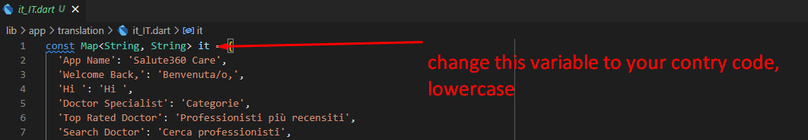

# Change App Language

1. To change the app language, copy and paste the file `lib/app/translations/en_US.dart`.
2. Rename the new file based on your language/country code (example: Italian `it_IT.dart`).
   - The first part is lowercase language code.
   - Then underscore.
   - Then uppercase country code.
   - Reference: [ISO language/country codes](https://docs.oracle.com/cd/E13214_01/wli/docs92/xref/xqisocodes.html)
3. Translate the values in the file, example:
   - `'Hallo': 'Hallo'` → `'Hallo': 'Hola'`
4. Don’t forget to change the variable name to your country code.
   
5. Open `lib/app/utils/localization.dart` and import your new translation file.
   
6. Run the app.

:::info
If you want to add new text in the app, make sure you add `.tr` after the string, example: `"Hallo".tr`. Then add the corresponding entry in your translation file.
:::
