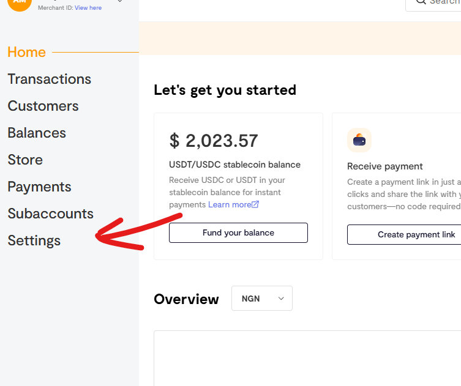
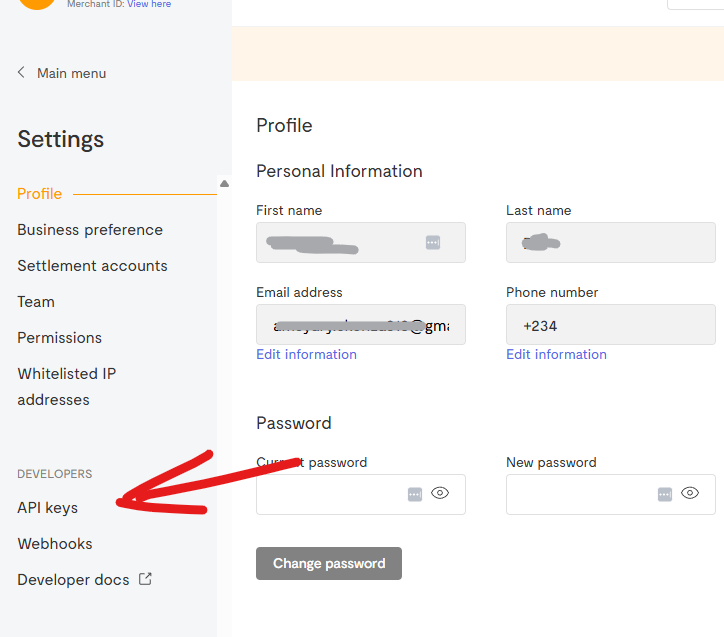
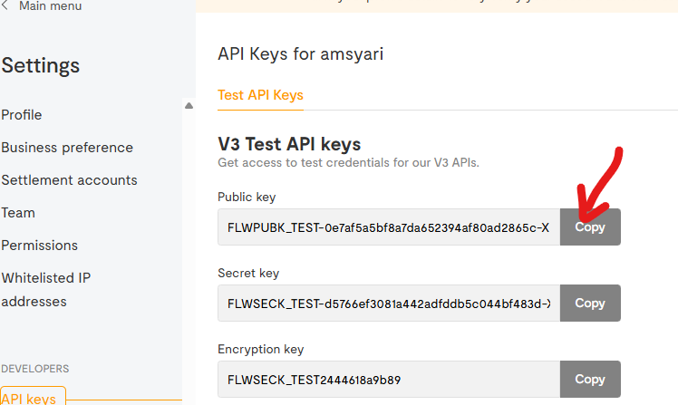

# Flutterwave Payment Gateway

This guide covers the **basic Flutterwave setup** (copy the Public Key into the Flutter client `.env`).

:::caution
This setup uses **client configuration only**.

For a secure production setup, you must implement **server-side verification + Flutterwave webhooks** in `/Halo_Doctor_Cloud_Function_Firebase`.
:::

## 1) Create a Flutterwave account

1. Register a new Flutterwave account: https://flutterwave.com/
2. After registration, open your Flutterwave Dashboard.

## 2) Copy your API Public Key

1. In Flutterwave Dashboard, go to **Settings**
   
2. In the Settings sidebar, choose **API Keys**
   
3. Copy the **Public Key**
   

## 3) Add the Public Key to the Flutter client (.env)

Paste the Public Key into the Flutter project `.env` file in `/Hallo_Doctor_Client_Firebase`:

```dotenv title="/.env"
# Flutterwave
FLUTTERWAVE_PUBLIC_KEY=FLWPUBK_TEST-your_public_key_here
```

That’s it — the Flutterwave public key is configured in the client.

## Next (recommended): secure it with webhooks

To prevent spoofed “payment success” messages from the client, implement a Flutterwave webhook endpoint and verify webhook signatures on the server.
