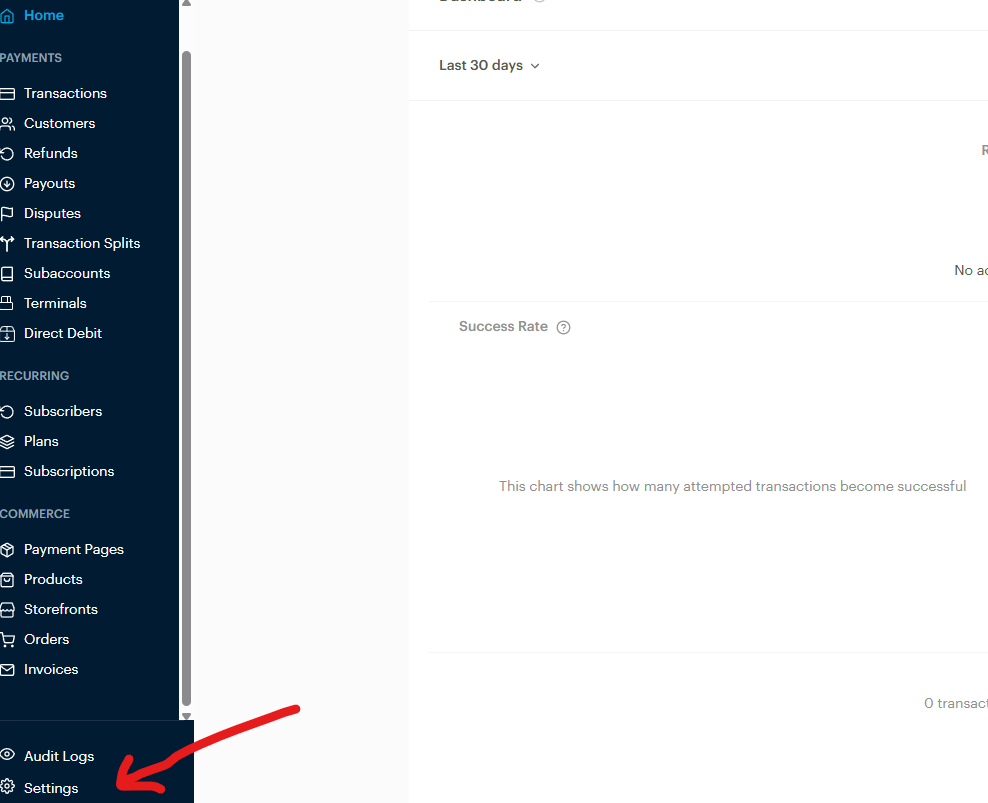
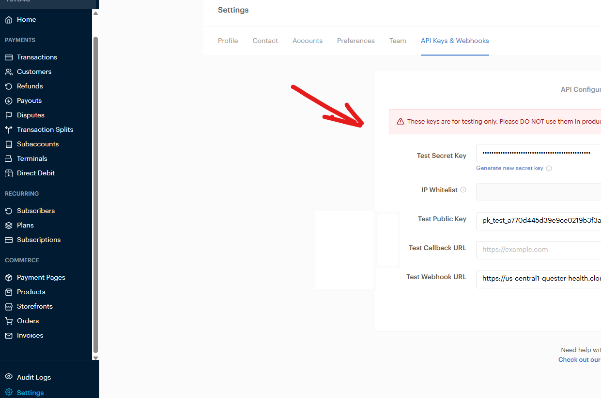

# Paystack Payment Gateway

This guide covers the **basic Paystack setup** (copy the secret key into Firebase Cloud Functions).

## 1) Create a Paystack account

1. Register a new Paystack account: https://paystack.com/
2. After registration, open your Paystack Dashboard.

## 2) Copy your Secret Key

1. From the Paystack Dashboard Home, click **Settings**
   
2. Click **API Keys & Webhooks**
   
3. Copy the **Secret Key** (`sk_test_...` / `sk_live_...`)

## 3) Add the Secret Key to Firebase Cloud Functions (.env)

Paste the secret key into the Cloud Functions `.env` file in `/Halo_Teacher_Cloud_Function_Firebase`:

```dotenv title="/Halo_Teacher_Cloud_Function_Firebase/.env"
# Paystack
PAYSTACK_SECRET_KEY=sk_test_your_secret_key_here
```

Deploy after changes:

```powershell
firebase deploy
```

That’s it — the Paystack secret key is configured in the Cloud Functions and the Paystack should work when you run the app.

## Next (recommended): add webhooks

In **Settings → API Keys & Webhooks**, you can also configure webhooks.

Suggested follow-up work:

- Add a webhook endpoint in Firebase Functions (example: `paystackWebhook`)
- Verify webhook signatures server-side
- Verify transaction status with Paystack API before marking an order as paid
