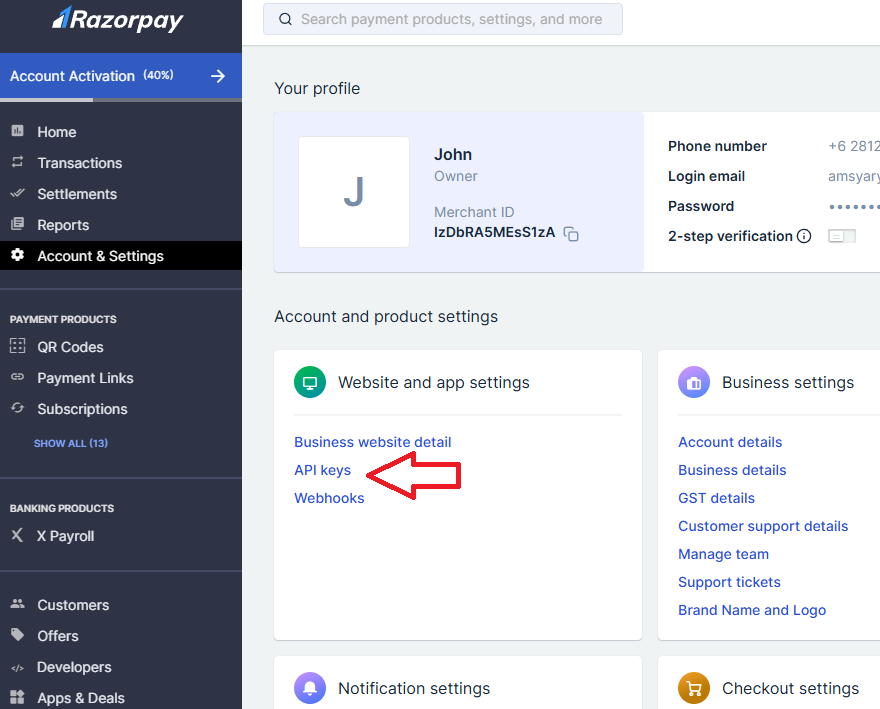
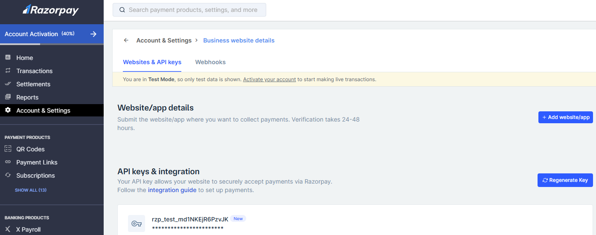

# Razorpay Payment Gateway

This guide covers the **basic Razorpay setup** (API key for the Flutter client).

:::caution
This setup uses **manual verification** only.

For a secure production setup, you must implement **server-side verification + Razorpay webhooks** in `/Halo_Doctor_Cloud_Function_Firebase`.
:::

## 1) Create a Razorpay account

1. Open Razorpay and register a new account: https://razorpay.com/
2. After registration, open your Razorpay Dashboard.

## 2) Generate your API key

1. Go to **Account & Settings** → **API Keys**



2. Click **Generate Key**



If you already generated a key before, the button will show **Regenerate Key**.

## 3) Add the key to the Flutter client (.env)

Copy the **Key ID** and paste it into the Flutter project `.env` file in `/Hallo_Doctor_Client_Firebase`:

```dotenv title="/.env"
# Razorpay
RAZORPAY_KEY=rzp_test_your_key_id_here
```

That’s it — Razorpay will be configured on the client, and your payment with Razorpay should work when you run the app.

## Next (recommended): secure it with webhooks

To prevent spoofed “payment success” messages from the client, implement a Flutterwave webhook endpoint and verify webhook signatures on the server.
