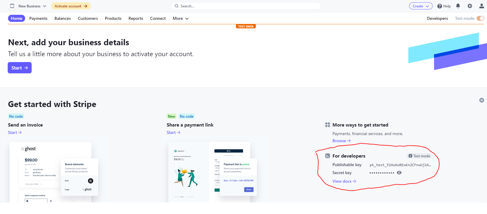

# Payment Gateway

A payment gateway is a merchant service provided by an e-commerce application service provider that authorizes credit card or direct payments processing for e-businesses,
here we will use a payment gateway to provide payment services for users, when they are about to place an order for a Teacher's timeslot

## Stripe Payment Gateway

here we will use Stripe payment gateway, because Stripe is one of the largest payment gateways, and is widely used, but if you want to use another payment gateway, modifying the app will be very easy, just change `lib\app\service\payment_service.dart`, but here we will use Stripe payment gateway

- goto Stripe official site and register new account https://stripe.com/
- when Stripe asks you to activate your account, you can **activate it later**
- for now we only need a `Publishable key` and a `Secret key` you can get it here https://dashboard.stripe.com/test/dashboard



- Copy Stripe `Publishable key` and paste it in `.env` file at `STRIPE_PUBLISHABLE_KEY=` in your `/Hallo_Teacher_Client_Firebase` flutter project

your `.env` file should look like this

```jsx title="/.env"
#Stripe Environment
STRIPE_PUBLISHABLE_KEY=sk_test_51HuXoBEwKn2CFnwUTqweh1Si9L0vG4zSbAbKm1OIhYLZA1R3ypELDXDCntEPJ9Y2nw62kwsKBn
```

for the Secret Key in Stripe Dashboard, we have to add it to the Firebase Cloud Function that we previously setup in folder `/Halo_Teacher_Cloud_Function_Firebase`

:::info
Stripe Secret Key must be added to the Firebase cloud Function, for verify payment
:::

## Add Stripe Key To Firebase Cloud

:::info
if your Hallo Teacher version is greater than or equal to `1.1.1` you just need to copy `Stripe secret key` to `.env` file at STRIPE_SECRET_KEY=put_your_stripe_key_here
and skip the next step in this page
:::

if your Hallo Teacher version is lower than or equal to `1.0.19` add the stripe cloud function with this step: 

- back to Firebase Cloud function folder `/Halo_Teacher_Cloud_Function_Firebase`
- open it with `CMD`
- run the command below, but change the key to your Stripe Secret Key

```
firebase functions:config:set stripe.token="sk_test_51HuXoBEwKn2CFnwUTqw8kKeh1Si9L0vG4zSbAbKm1OWpRfIhYLZA1R3ypELDXDCntE28PJ9w62kwsKBnuzHkszK"
```

- now we can deploy it using this command

```
firebase deploy
```
