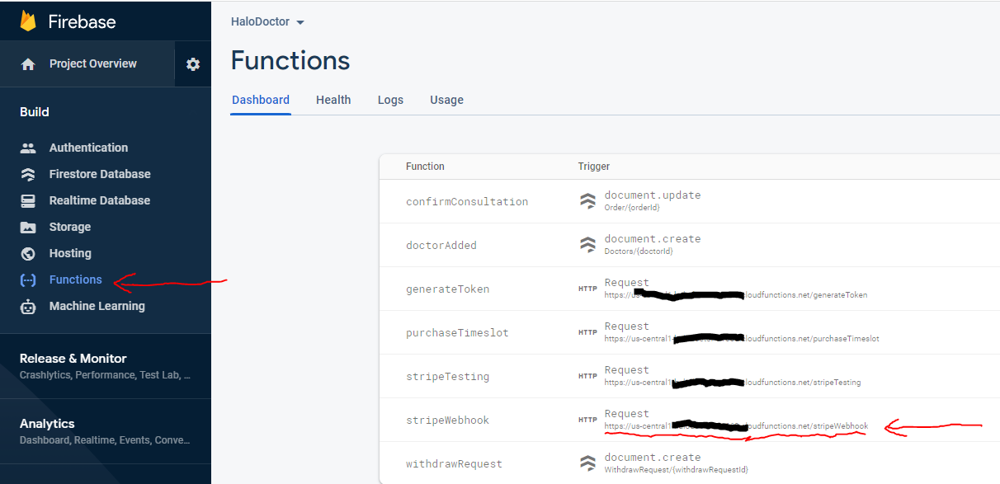
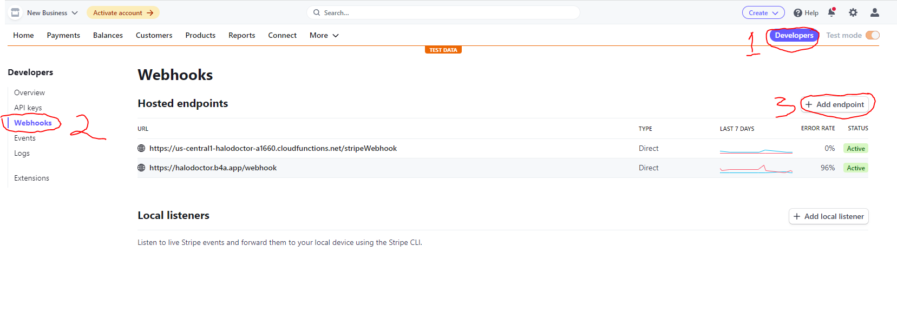
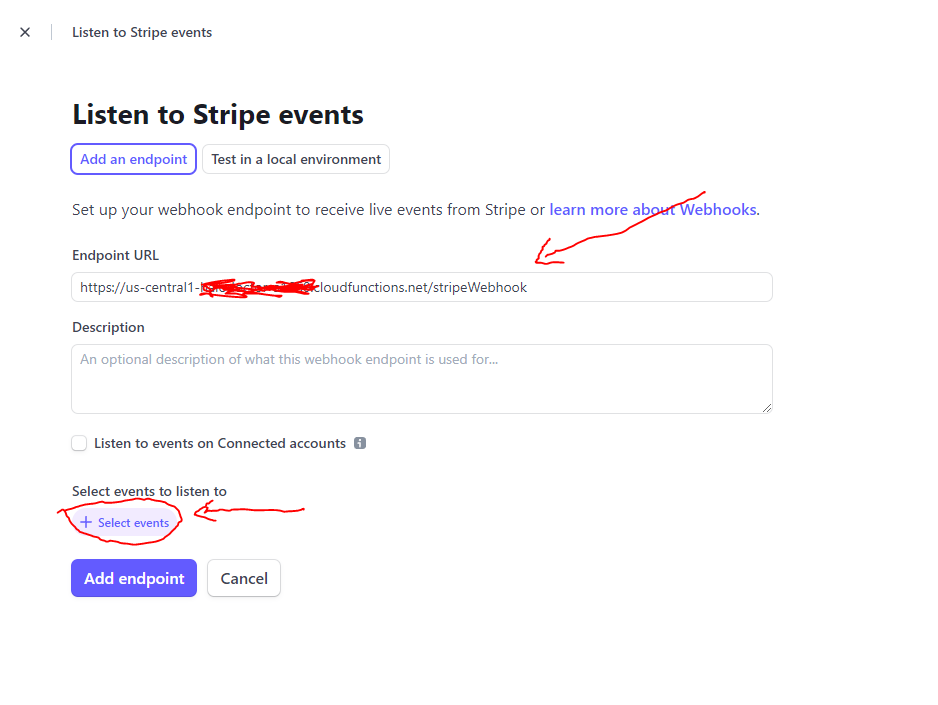
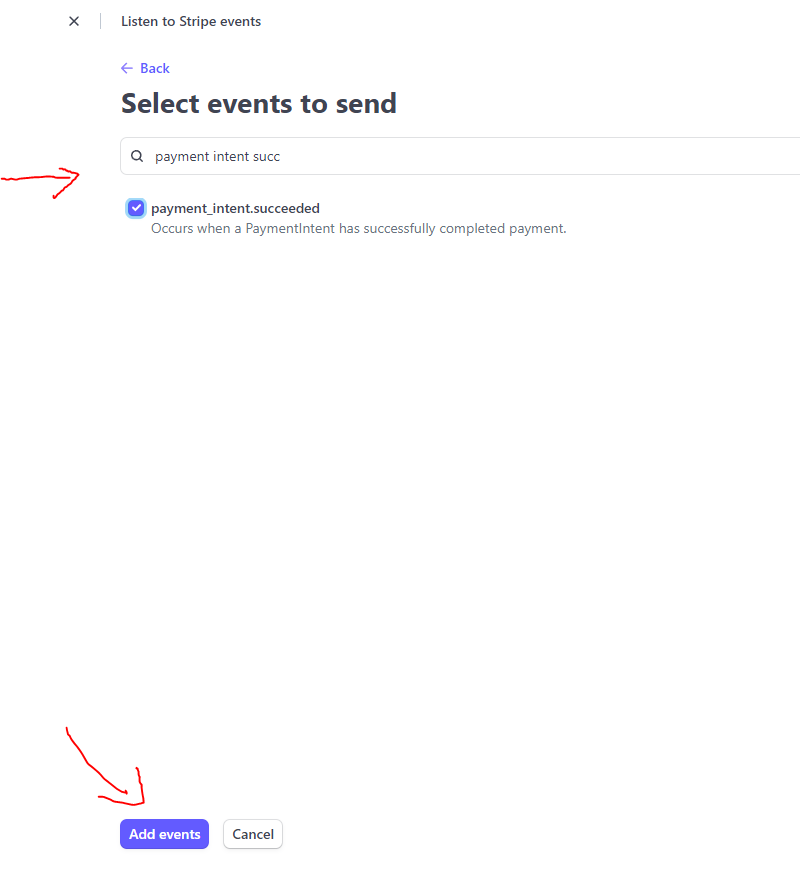
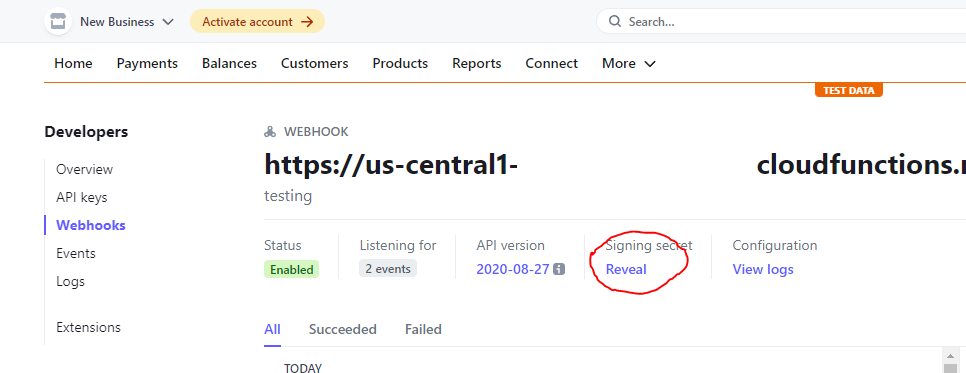

# Stripe Webhook

after we have successfully deployed our Firebase Cloud Function, then we have to set up the stripe Webhook, its function is so that we can get notifications to our firebase server when a payment has been successfully made, and we can handle it like change client order status, to `success`

to setup Stripe Webhook :

- we need stripe webhook url, open your Firebase Console -> Select your project -> `Functions`
- then copy URL from `stripeWebhook` section



- after you copy `stripeWebhook` url, goto stripe [dashboard](https://dashboard.stripe.com/)

- click `Developer` top right corner, -> click `Webhooks` -> and then click `Add Endpoint`



- paste that `stripeWebhook` url, in `Endpoint Url` sections

- and click `select event`



- search `payment intent success` -> activate it -> `Add events`

- click `Add Endpoint`



- and then copy sign in secret from that `webhook`



## Add Stripe Webhook Signin To Firebase Cloud

:::info
if your Hallo Teacher version is greater than or equal to `1.1.1`  you just need to paste your webhook secret to .env,
at line STRIPE_WEBHOOK_SECRET=paste_your_key_here or just follow the .env_example
:::

if your Hallo Teacher is lower or equal than `1.0.19` follow this step : 

- back to Firebase Cloud function folder `/Halo_Teacher_Cloud_Function_Firebase`
- open it with `CMD`
- run the command below, but change the key to your `Stripe Webhook Signin Key`

```
firebase functions:config:set stripe.webhook_secret="whsec_WHU0THjzLGM6uhhctNK6ikdsi0"
```

- now we can deploy it using this command

```
firebase deploy
```

- OK, the application is now able to accept webhooks from stripe, and confirm payments

**Next we have to setup a video call with agora.io**
