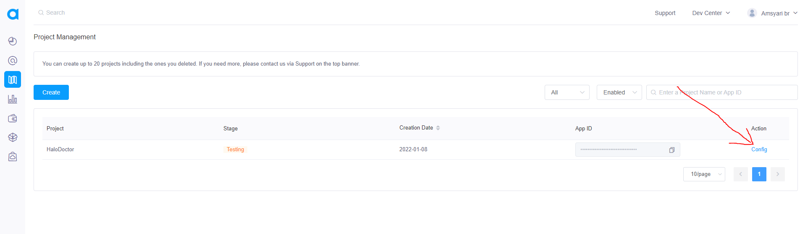

# Agora.io for Video Call

agora provides a library to make video calls, with a very easy setup, this project uses agora.io to make video calls between Teachers and clients, in order to make our video calls working wll we need `App id` in agora, and `App Certificate` to get that

- First register new account at https://www.agora.io/
- after registering a new account, goto Agora Console [Agora Console](https://console.agora.io/)
- create new Project


- add the app name and select `Secure Mode App Id + Token` and -> `Submit`


- next we have to take the `App Id` and `App Certificate` from the agora project that we just created, we click `config`



:::info
if your Hallo Teacher version is greater than or equal to `1.1.1` you just need to copy `App id` and `App Certificate` to `.env` file, put `App id` to `AGORA_APP_ID=paste_your_app_id_here` and `AGORA_CERTIFICATE=paste_your_agora_certificate_here` and skip the next step in this page
:::

if your Hallo Teacher version is lower than or equal to `1.0.19` follow this step to add `Agora App id & App Certificate`:

- Copy `App id ` and `App Certificate` to file `/Halo_Teacher_Cloud_Function_Firebase/functions/agora-functions.js` at line 31

```jsx title="/Halo_Teacher_Cloud_Function_Firebase/functions/agora-functions.js"
const token = RtcTokenBuilder.buildTokenWithUid(
  "Change this to your App Id",
  "Change this to your App Certificate",
  channelName,
  uid,
  role,
  privilegeExpireTime
);
```
**update if you, have downloaded the latest version of HalloDoktor, to add agora App id and certificate are no longer in the agora-functions.js file but we add it to our firebase config, like token stripe, the method is very easy, run the command below but first change the app id to your app id**

```
firebase functions:config:set agora.agora_appid="CHANGE TO YOUR AGORA APP ID WITH DOUBLE QUOTE"
```
also run this command for adding agora certificate, make sure you change the certificate
```
firebase functions:config:set agora.agora_certificate="CHANGE TO YOUR AGORA CERTIFICATE WITH DOUBLE QUOTE"
```

to check if your agora app id has been set up correctly, you can check it using the command below
```
firebase functions:config:get
```

**after all that, run the below command to deploy your firebase cloud**


:::warning
make sure you are in root directory `/Halo_Teacher_Cloud_Function_Firebase` to run this command in CMD
:::

```
firebase deploy
```
