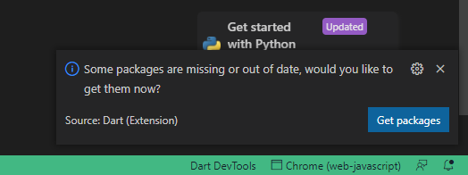

# Setup Client Flutter Project

Throughout this tutorial I will be using Visual Studio Code, if you want to use Android Studio, the steps are almost the same

## Step No.1 Open Project in Visual Studio Code

to open a project in Visual Studio Code, it's very easy

- Open Visual Studio Code -> Click File -> Open Folder -> chose `/Hallo_Teacher_Client_Firebase` folder

or

- Open CMD if you use windows
- Go to `/Hallo_Teacher_Client_Firebase` directory
- and type `code .`

visual studio code will be opening in that directory

## Step No.2 Install Project Dependencies

after the Hallo Teacher Client project opens in Visual Studio code or in Android Studio, we will install all the dependencies

when you open Hello Teacher Client for the first time in Visual Studio Code, Usually a dialog will appear in the bottom right corner, asking you to directly install all dependencies, just click `Get packages`



but if the dialog doesn't appear, or an error occurs while installing dependencies, you can directly install all dependencies in the following way

- open terminal in Visual Studio Code `` CTRL + ` `` or `Click Terminal -> New Terimal`
- type `flutter pub get`
- once that's done, all dependencies should be installed

## Step No3. Create .env File

.env file or dotenv file is a simple text configuration file for controlling your Applications environment constants,
simply we need an .env file to store all the keys which are very secret, this .env file will be encrypted by the `flutter_dotenv` package

- Create a file in the root folder with the name `.env`
- Copy all the text in the `.env_example` file into the `.env` file you just created

```jsx title="/.env_example"
#Stripe Environment
STRIPE_PUBLISHABLE_KEY=
```

Next we will fill empty values above
