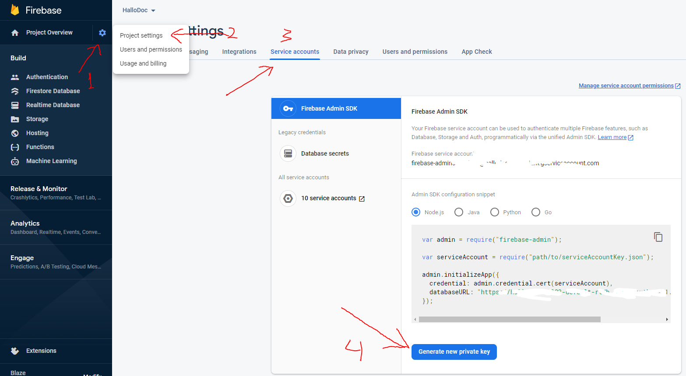
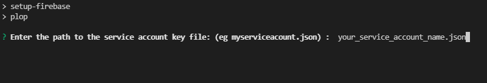
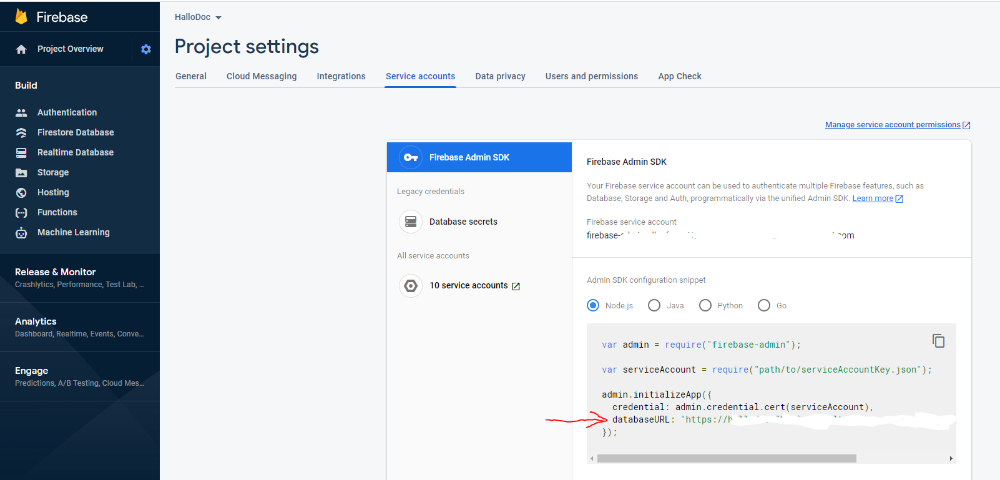
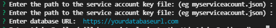

# Setup Doctor Category & Admin Account

after you successfully deploy your Firebase Cloud Functions to Firebase, in the previous tutorial, and try to run your client app, you will see that the Doctor category is still empty, well because we still haven't imported the Doctor category into our Firestore Database,
we will also setup `admin email & password` that you will use when you want to log in on the `Hallo Doctor Web Admin Dashboard`

- To setup Doctor category & admin credentials, open `Command Prompt` in folder `/Halo_Doctor_Cloud_Function_Firebase/functions`
- inside `/functions` folder run 
```
npm run setup-firebase
```

- You'll get prompted to enter the path to you service account key file, To generate it, go to your `Firebase Dashboard`, `Project settings` tab and then to `Service accounts` option



- after downloading it you can directly enter the path in the command line earlier, or more easily put your service account file in the `/functions` folder, and you just have to type the service account file name in command line



- after that you have to enter your database url, you can get it on the same page when you download your service account





- Next you have to enter your `email address` and `password` that will be used to login to your web admin dashboard

:::caution

make sure the password is six characters or more, and make sure you remember the `email & password`

:::

if everything goes well, the Doctor category should have been added and the admin credentials to login to the web admin should have been setup

Next we will setup the Web admin dashboard
