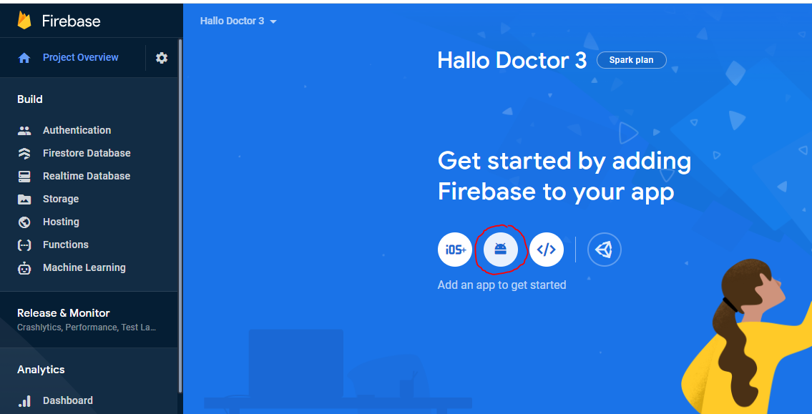
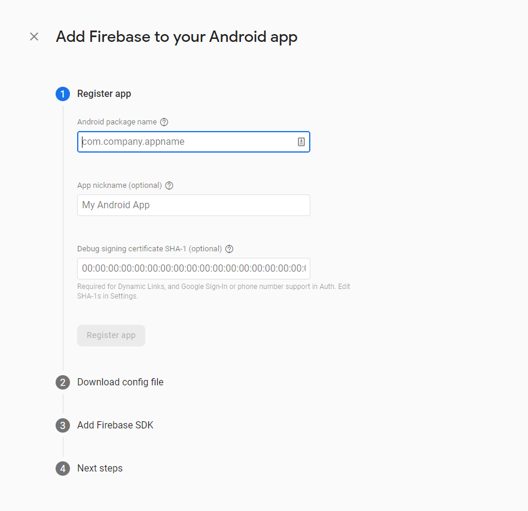
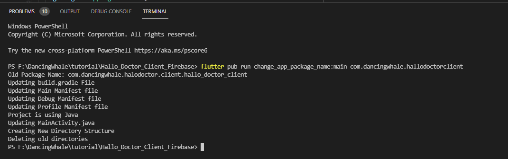
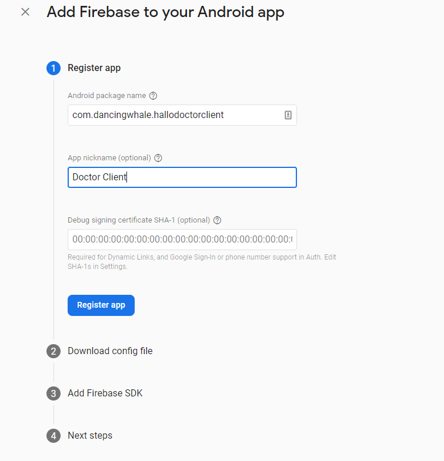
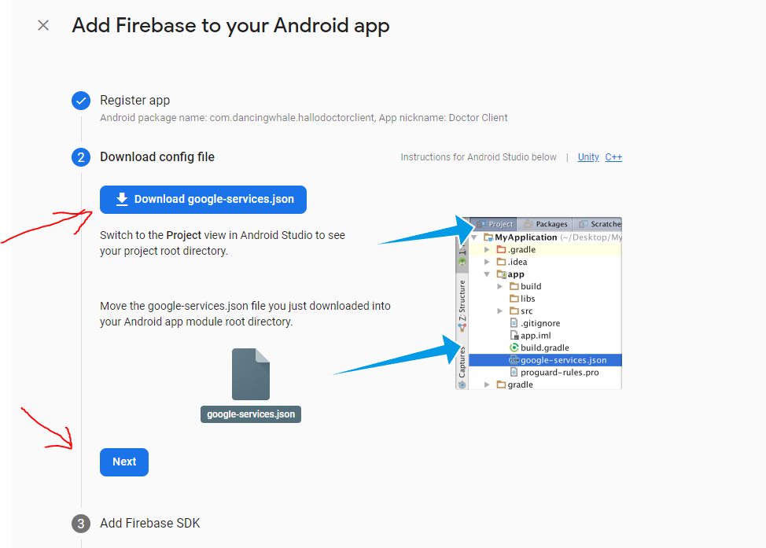
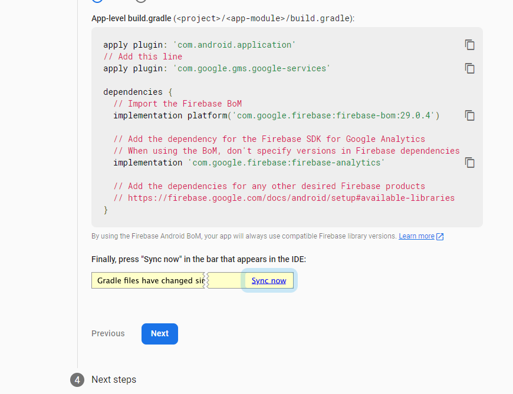
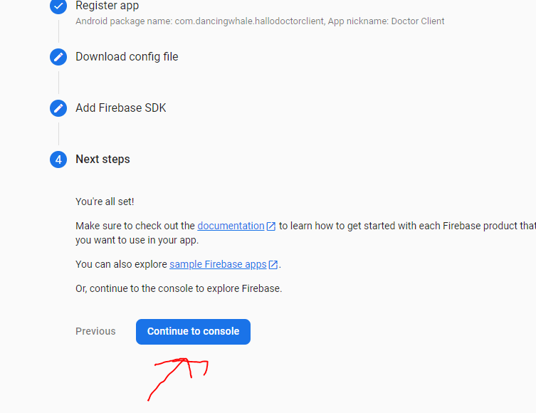

# Create Android App in Firebase Project

After creating a firebase project, in this project we can create several apps with different configuration, here we will create Hallo Teacher Client Android App.

## Create Hallo Teacher Client Android App 

- Click android icon



- After that we are required to fill in three information about our app, `Package Name`, `App Name`, and `SH1 Key`

  

- first we need the package name of our app, to get the package name of our app

### Get Package name

- in your Project Flutter `Hello Teacher Client`, which was already open using visual studio code, or Android Studio

:::info

make sure you've downloaded all the dependencies in this project, by running `flutter pub get` command

:::

- we will change the default package name of this app to your package name, this will be very easy and fast because this project already uses `change_app_package_name` flutter package https://pub.dev/packages/change_app_package_name

- run the command below, but first change `com.mycompany.myappname`, to your package name

```
flutter pub run change_app_package_name:main com.mycompany.myappname
```

- if successful it will look like this



- so after that, the package name in your `Hello Teacher Client` app has all changed,
  and you can copy the package name to firebase
- and add your App nickname



- for debug signing, we can fill it later, just click register app

- after that you have to download the `google-service.json` file



- and copy the file into your app project in the directory `android/app/`

:::info
if in that folder there is already a `google-service.json` file change it to your file which you just downloaded,
and make sure there is no typo in the filename `google-service.json`
:::

- after that click next in firebase,



- and click Continue to console



- congratulation your app is now registered
- but we need to enable some Firebase features for our app, like authentication, so we can login, continue to the next section
