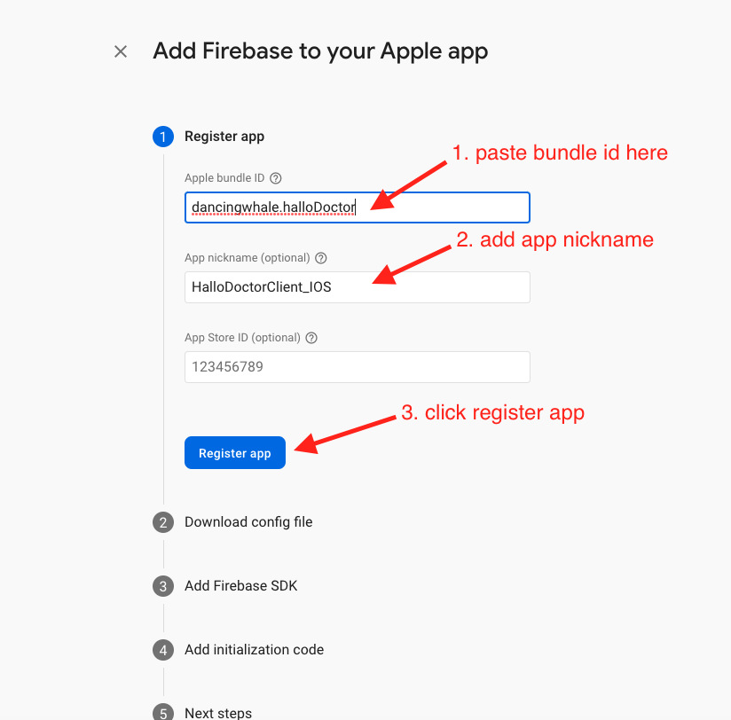

# Create IOS App in Firebase Project

Here we will setup Hallo Teacher Firebase to IOS, if you only wanto build the app to Android you can skip this section

## Create Hallo Teacher Client IOS App 

in your firebase project : 

- Add new ios app by clicking Ios icon in the home page

- After that we are required to fill in three information about our app, `Apple Bundle Id`, `App Nick name (optional)`, and `App Store id (optional)`'

- Add app bundle id

to get app bundle id we need to open our Hallo Teacher Client ios app in the xcode : 

- Open `\Hallo_Teacher_Client_Firebase` in the vscode

- After the Hallo Teacher Client Project is open, you need to right click on the `ios` folder and click open in xcode

- After the xcode is open we need to click Runned -> General 

- and there you can copy the app bundle id, and paste it to our firebase 
- and then add your `App Nick ame`, and for `App Store Id` you can add it later
- click register app

- After that you need to download `GoogeService-Info.plist`

- Make sure there's no number in the `GoogleService-Info.plist` file name
  

- Copy that GoogleService-Info.plist` file to xcode Runner->runner
  
:::info

it's mandatory to copy the file in xcode, otherwise it will not work

:::

- Follow setting bellow to copy the file

- click finish, and that's it for Client App

- if you having trouble following this ios documentaion here is the [Video Tutorial you can follow](https://www.youtube.com/watch?v=hy0NtR0NW4Q)

- and Repeat this proccess for the `Teacher App` in folder `/Hallo_Teacher_Teacher_App_Firebase`

- after that continue to the next step