# Deploy Firebase Cloud Function

## What is Firebase Cloud Function

Cloud Functions for Firebase is a serverless framework that lets you automatically run backend code in response to events triggered by Firebase features and HTTPS requests. Your JavaScript or TypeScript code is stored in Google's cloud and runs in a managed environment.

so simply we will deploy the cloud function in the `/Halo_Teacher_Cloud_Function_Firebase` folder to our firebase project

## Set up Node.js and the Firebase CLI

You'll need a Node.js, and you'll need the Firebase CLI to deploy functions to the Cloud Functions runtime.

- Install [Node.js](https://nodejs.org/en/download/) and Npm

:::important
Node.js versions 10, 12, and 14 are supported. See Set runtime options for important information regarding ongoing support for these versions of Node.js.
:::

Once you have Node.js and npm installed, install the Firebase CLI via your preferred method. To install the CLI via npm, use:

```
npm install -g firebase-tools
```

- after installing Node Js, and Firebase Cli we will initialize our firebase cloud

## Initialize Firebase Cloud

Open terminal in folder, `/Halo_Teacher_Cloud_Function_Firebase` if you use Windows open it with `CMD`

- inside that folder type

```
firebase init
```

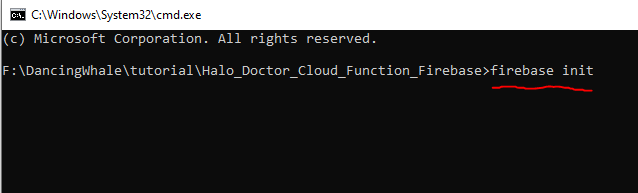

- if this is your first time using the firebase cloud function, chances are you will be asked to login first, authenticate using the firebase account that you created the project

- after that, you'l be asked if you ready to proceed, type `Y` and then enter

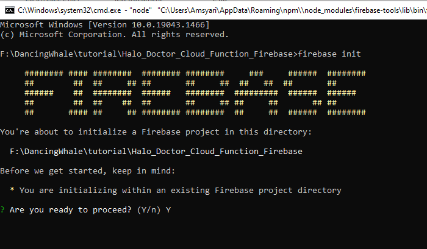

- after that you will have to choose what features to activate by pressing the `space bar`, activate the features below
  - Firestore,
  - Functions,
  - Storage

after the feature is selected, press Enter

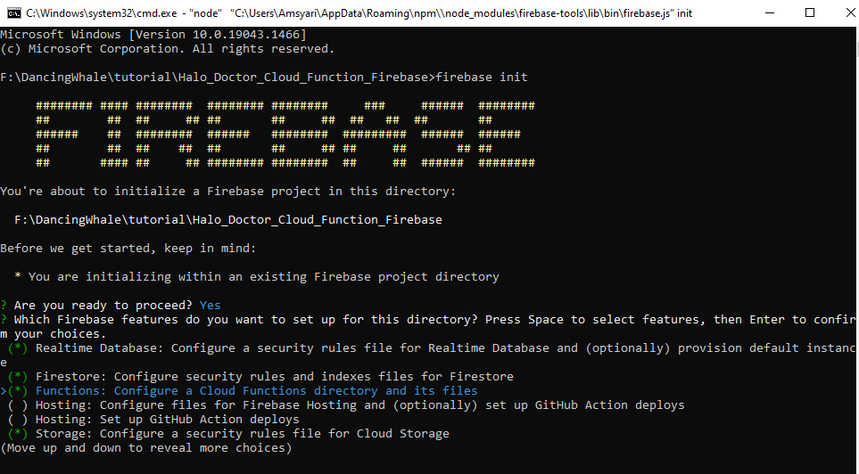

- after that, select `Use an Existing project` -> enter

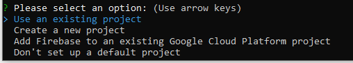

- choose the project we just created -> enter

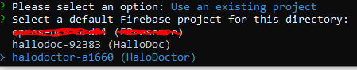

:::warning
if the question wants to overwrite the file, choose `No` or `N`, because if you choose yes, the file will be lost and you will have to copy it again
:::

- type `N` and then Enter

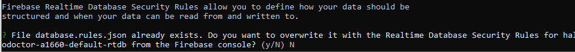

- for the questions below, just leave it blank, just press enter

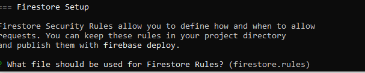

:::warning
again, the question wants to overwrite the file, choose `N` or no
:::

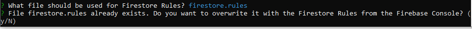

- for the questions below, just leave it blank, just press enter

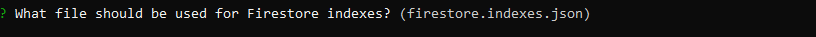

:::warning
again, the question wants to overwrite the file, choose `N` or no
:::

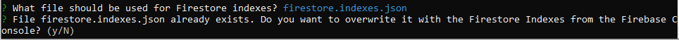

- choose Typescript (new update with typescript support)

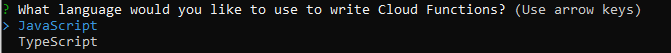

:::warning
choose no in the questions below,
:::

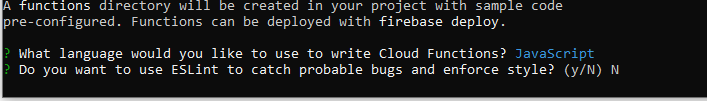

:::warning
again, the question wants to overwrite the file, choose `N` or no
:::

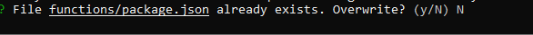

:::warning
again, the question wants to overwrite the file, choose `N` or no
:::

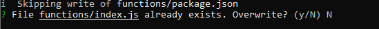

:::info

now you can choose yes, because the question wants to install dependencies

:::


- for the questions below, just leave it blank, just press enter

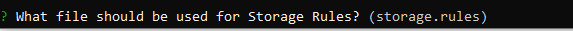

:::warning
again, the question wants to overwrite the file, choose `N` or no
:::


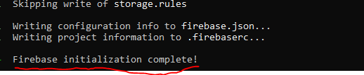

- after all that, our firebase cloud function has been successfully initialized but we have to add `Stripe Token` and `Agora Credential`, before we can deploy it to firebase, next we will setup our `Stripe keys`
