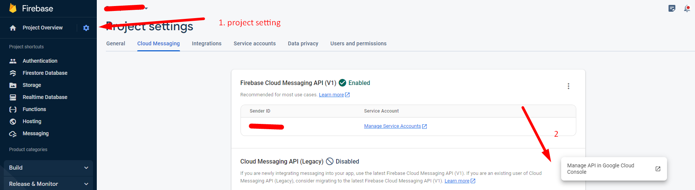
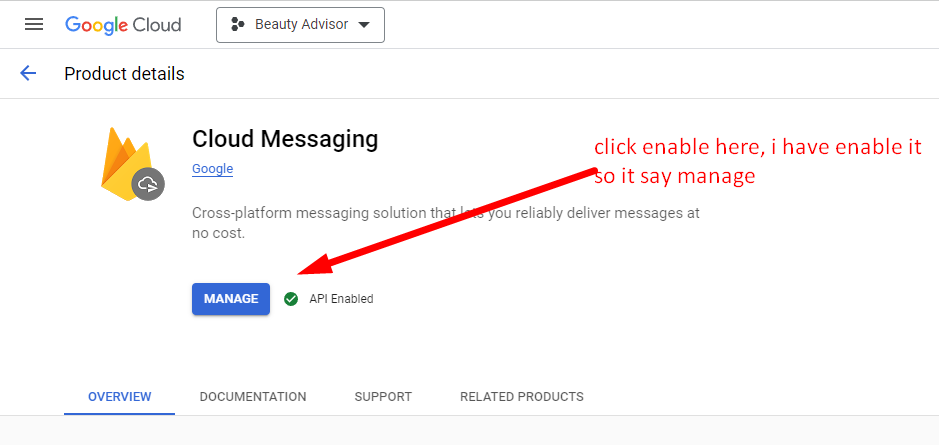

# Enable Firebase Notification

We need to enable firebase messaging to be able to use Firebase notification feature, in order to do that follow this tutorial :

- Open your firebase project
- Open `Cloud Messaging` tab
- at `Cloud Messaging API` click three dot to open pop
- click `Manage API in Cloud Console` 
  
  
  
- in Cloud console, click Enable
  
  
