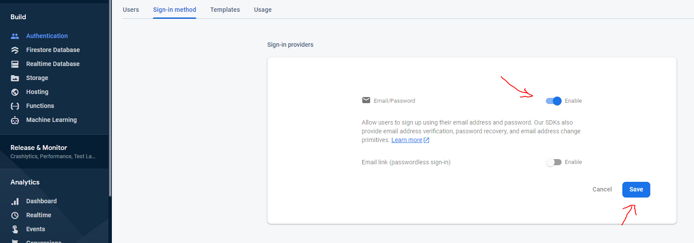
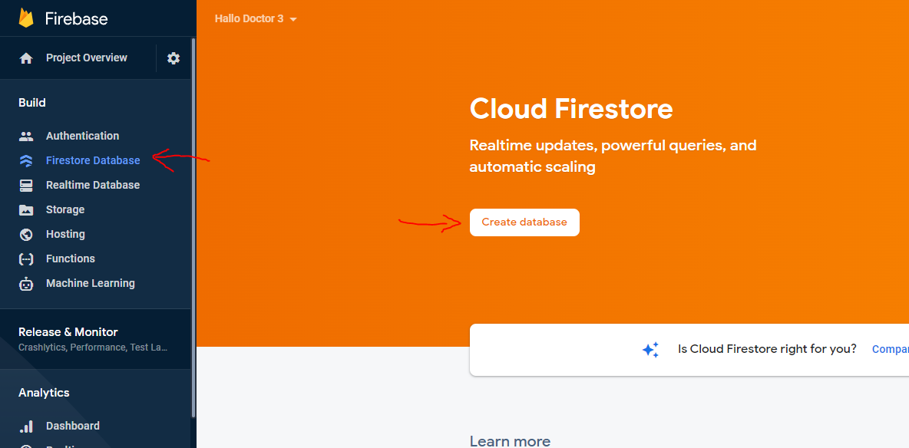
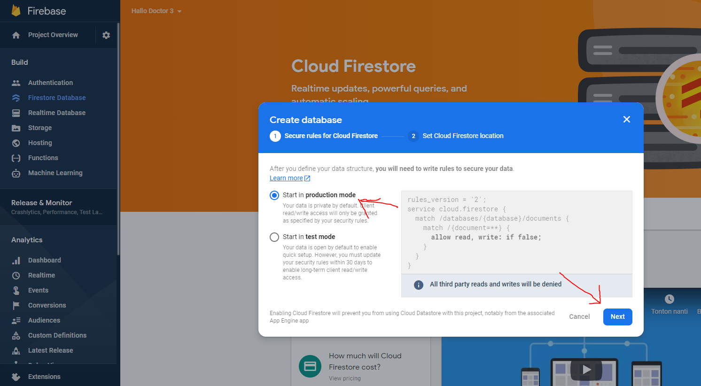
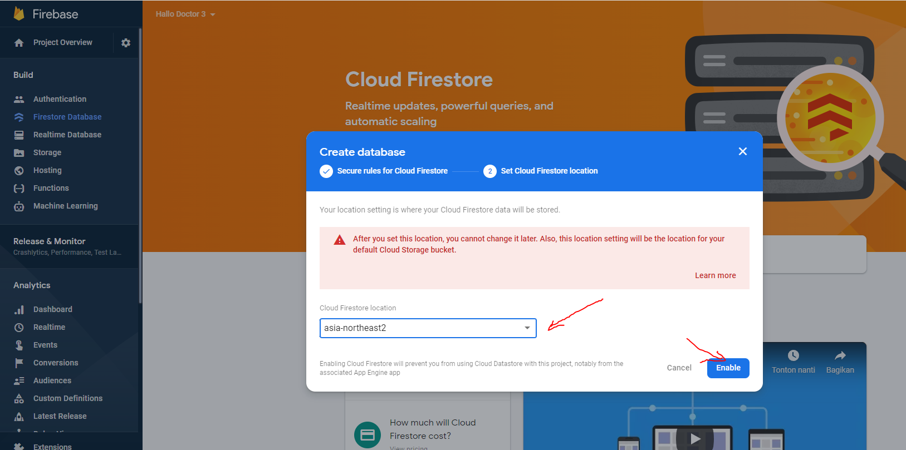
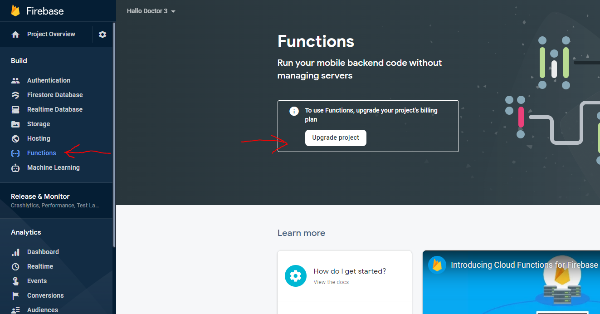
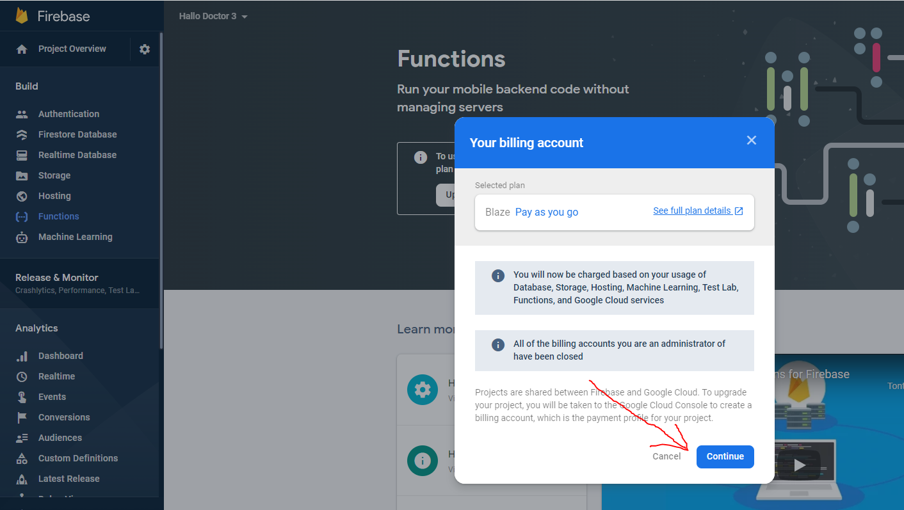
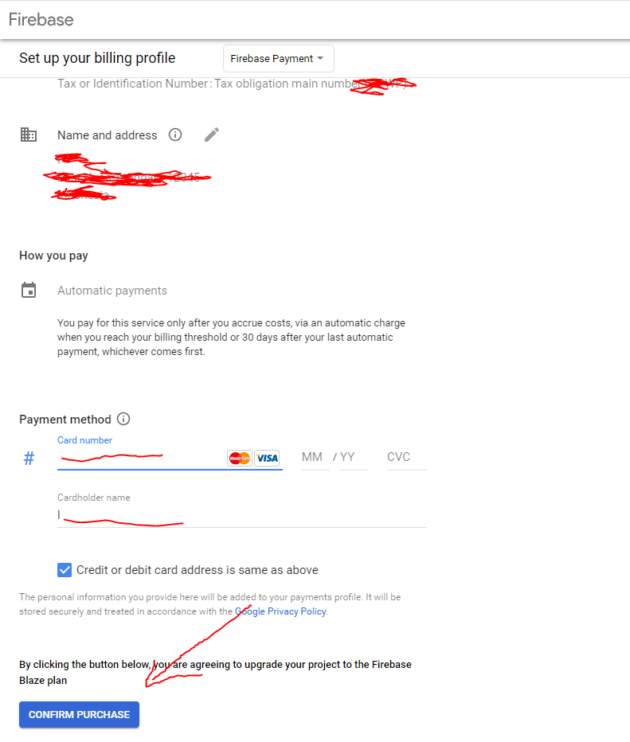
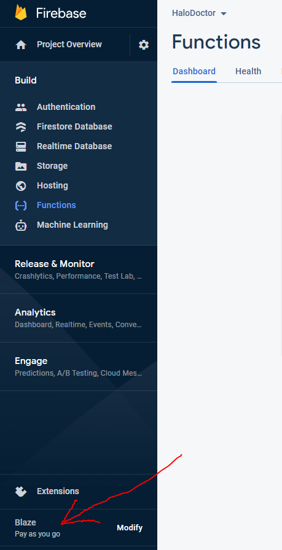

# Enable Firebase Feature

after we add our app in firebase and put the `google-service.json` file into our project, we need to enable some firebase features that our app uses, first is the authentication feature, so that our app can register a new account and also login

# 1. Enable Firebase Authentication

- in Firebase Dashboard, click `Authentication` -> `Sign in Method` -> `Email/Password`

- and then enable email, and click `save`

# 2. Enable Firebase Firestore

we also need to enable Firebase Firestore, so we can save our app data in firebase

- click `Firestore Database` -> `Create Database`

- and chose `Start in Production Mode` -> and then click `Next`

- and then chose datacenter near you, and click `Enable`

# 3. Enable Firebase Functions

we also need to enable Firebase Firestore, but to activate the firebase function, we are required to upgrade our project to the Blaze Plan

- Click `Function` and click `Upgrade Project`

- Click `Continue`

- and here you are required to enter payment information, but don't worry you will not be charged a fee, as long as your resource usage is still within the limits set by firebase here https://firebase.google.com/pricing

- After your blaze plan is active, your firebase function should also be active

- okay, for now that's the only feature that must be activated in this Firebase panel, the rest will be activated when we deploy the Firebase Cloud
