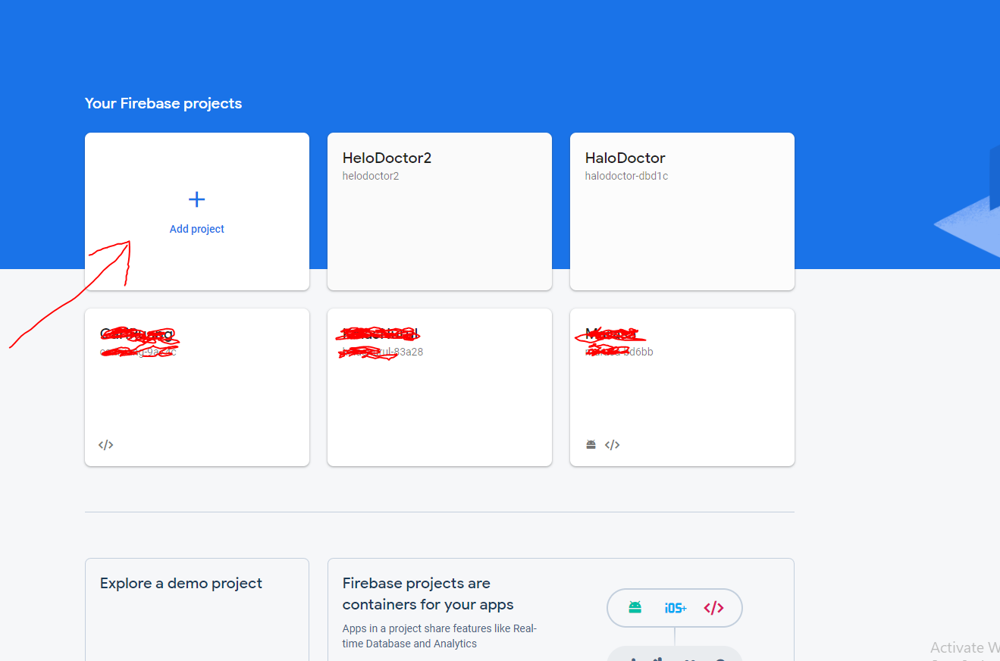
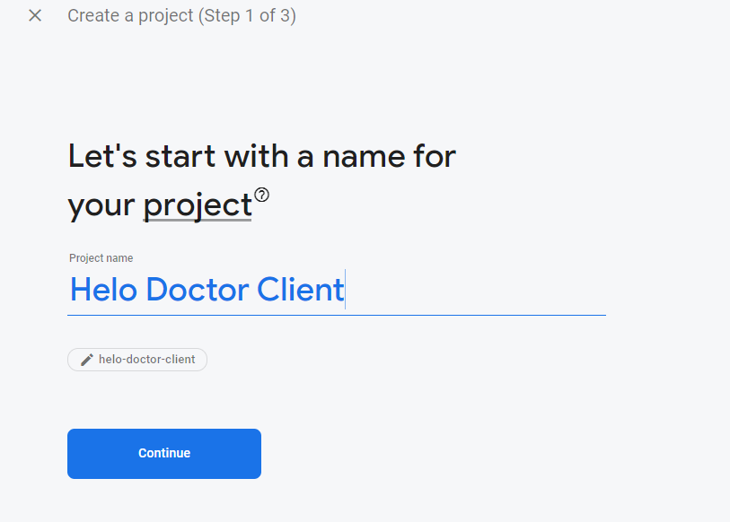
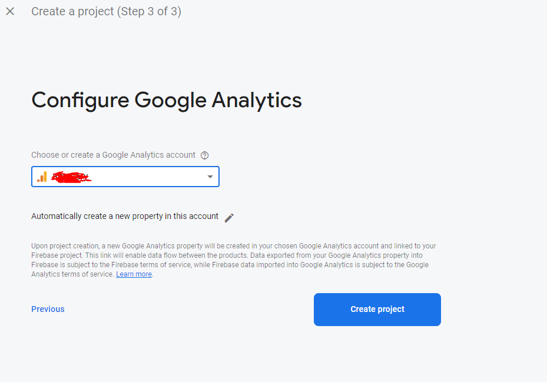

# What is Firebase

Firebase is a Backend-as-a-Service (Baas). It provides developers with a variety of tools and services to help them develop quality apps, grow their user base, and earn profit. It is built on Google’s infrastructure.

Firebase is categorized as a NoSQL database program, which stores data in JSON-like documents.

## Setup Firebase

- Register free account at https://console.firebase.google.com/

- after register, click `Build new App` at https://dashboard.back4app.com/apps

- after that enter your `app name` it can be up to you, here I enter the name "Helo Teacher"

- and then click Continue

- Then you will be asked to choose your Google Analytics account
- choose your account and click Create Account

- done, you have successfully created a firebase project, then in this project we will create several firebase apps
