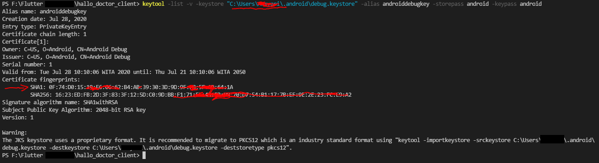
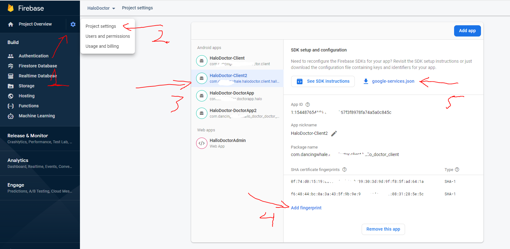
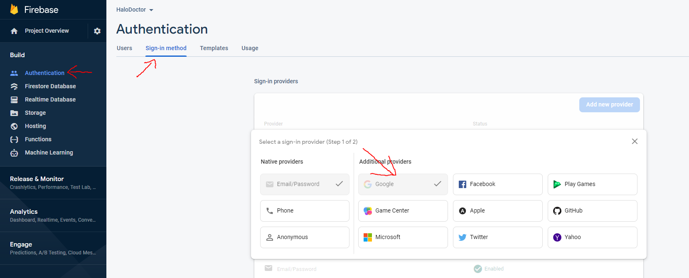
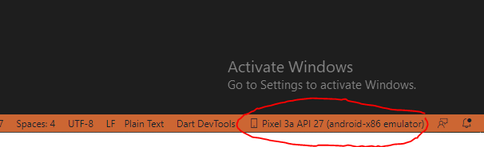
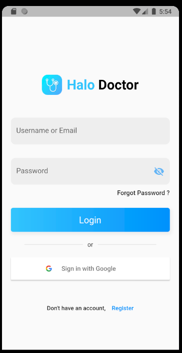
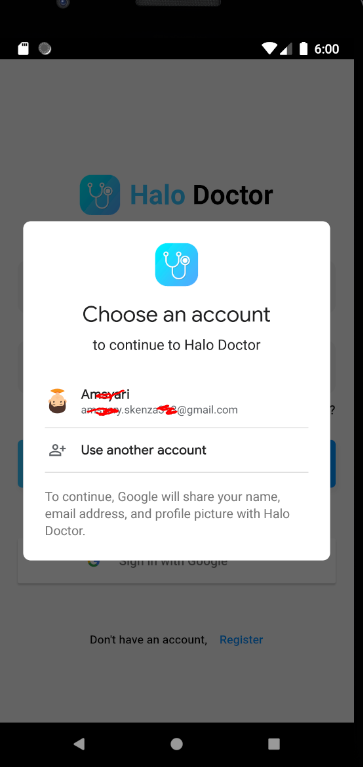

# Setup Android Google SingnIn

## Registering the app for google sign-in

to activate the google sign in feature, we need the `SHA1 key` , from our sign in key, there are two channel sign in keys, the first is debug sign in, and the second is release key signin

### Debug Sign In Key

if you are in development, you usually use the default debug key, you don't need to generate the key first, we can directly get the `SHA1 Key` from the default debug key

- it's very easy, run the command below, but first replace `yourusername` with your computer's username

```
keytool -list -v -keystore "C:\Users\yourusernamehere\.android\debug.keystore" -alias androiddebugkey -storepass android -keypass android
```

:::info
if you getting error `'keytool' is not recognized as an internal or external command` refer to [this](https://codewithandrea.com/articles/keytool-command-not-found-how-to-fix-windows-macos/)
:::

- if success you should get your SHA1 key



- the next step is put that SHA key to your firebase `project settings`



- and then redownload `google-service.json`, put that in `/Hallo_Teacher_Client_Firebase/android/app/`

- before running the app, make sure you activate google sign in provider on firebase




- thats it, you can now login using google account

## Run Helo Teacher Client App

- to run this helo Teacher application, make sure your emulator is running, or your real device is connected

- you can see it in the bottom corner of Visual Studio Code



- to run it please press **`F5`**

- if everything run well, no error it should look like this



- you can now register, or sign in with google account with no problem



:::info
if the Helo Teacher app feels a little lag, or jittery, it's because the app is in debug mode if you release the app, everything will be smooth
:::
