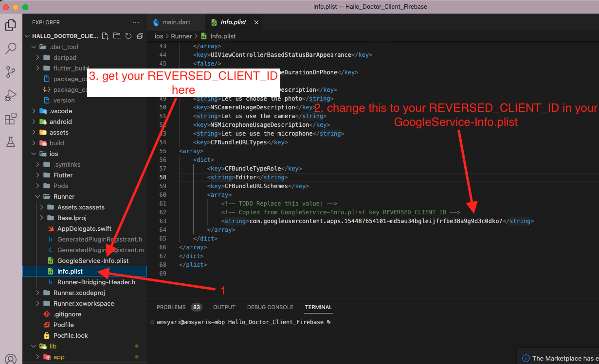
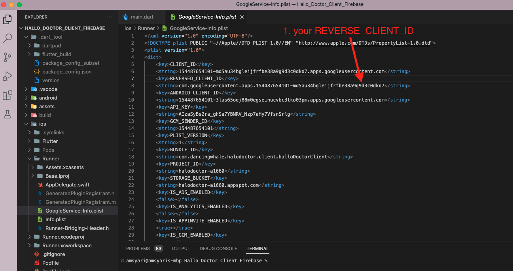

# Setup IOS Google SignIn

## Registering the app for google sign-in

to activate the google sign in feature on ios app its very straightforward, we only need to change `URL` from `Info.plist` file

### Change URL

you can change `URL` scheme in xcode or Visual Studio Code, you need to open the `Info.plist` file

- Using Visual Studio Code open `/Hallo_Teacher_Client_Firebase/ios/Runner/Info.plist`

that's it, you can now sign in with google in your ios device

