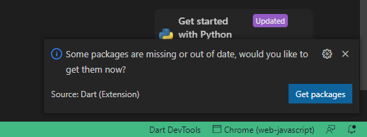
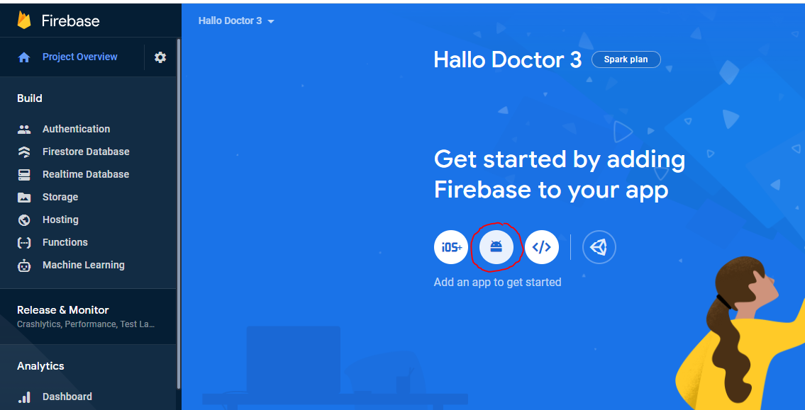
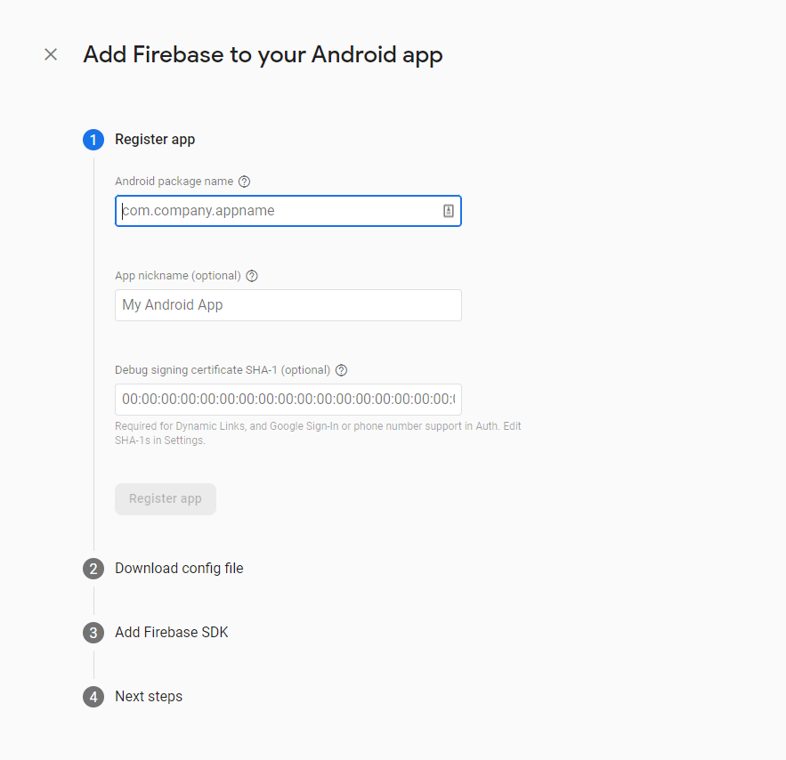
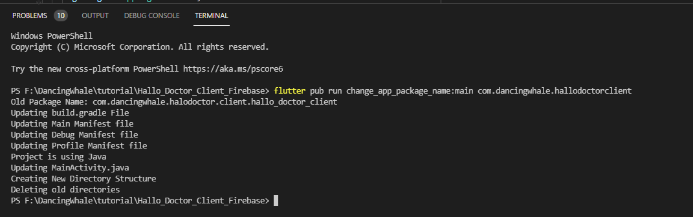
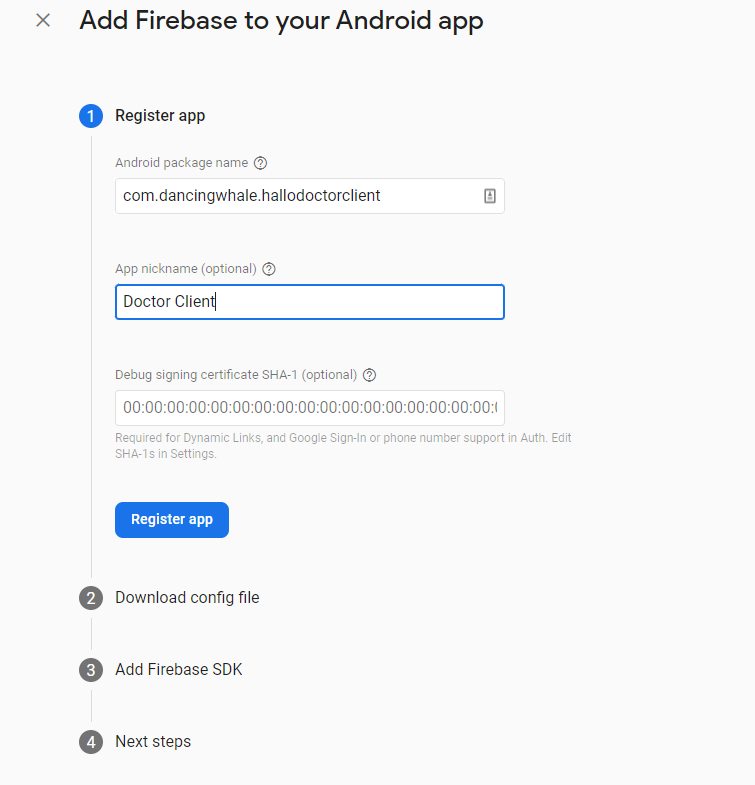
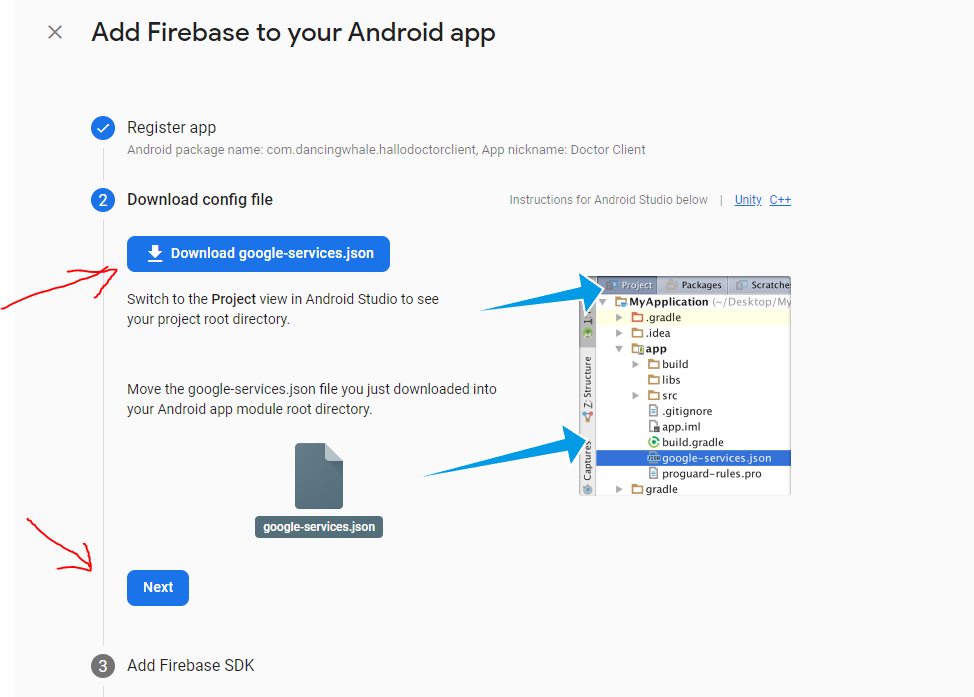
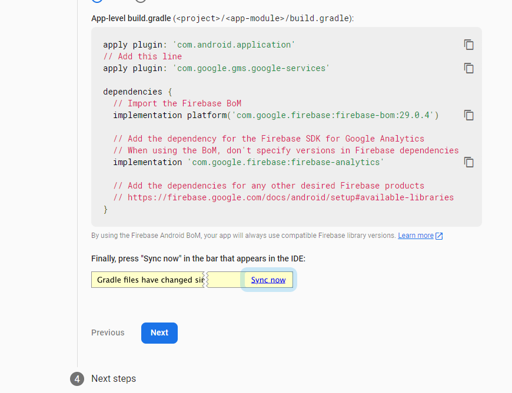
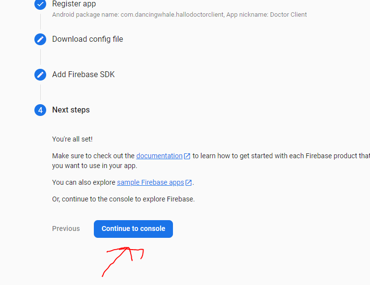
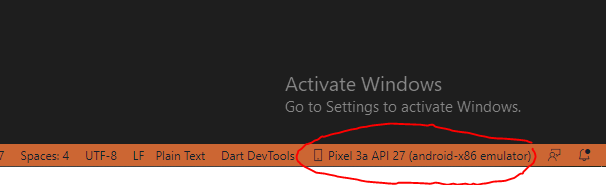

# Setup Teacher App

after we have set up the client app, now is the time to set up the Teacher app, actually almost the same way and most of it we have done earlier,
so here it should be quick, we only have setup firebase for Teacher App

## 1. Open `Hallo Teacher - Teacher App` in Visual Studio Code

- Open Visual Studio Code -> Click File -> Open Folder -> chose `Hallo_Teacher_Teacher_App_Firebase` folder

or

- Open CMD if you use windows
- Go to `Hallo_Teacher_Teacher_App_Firebase` directory, you can your command cd
- and type `code .`

visual studio code will be opening in that directory

## Step No.2 Install Project Dependencies

after the `Helo Teacher : Teacher App` project opens in Visual Studio code or in Android Studio, we will install all the dependencies

when you open `Hello Teacher : Teacher App` for the first time in Visual Studio Code, Usually a dialog will appear in the bottom right corner, asking you to directly install all dependencies, just click `Get packages`



but if the dialog doesn't appear, or an error occurs while installing dependencies, you can directly install all dependencies in the following way

- open terminal in Visual Studio Code `` CTRL + ` `` or `Click Terminal -> New Terimal`
- type `flutter pub get`
- once that's done, all dependencies should be installed

## Step No 3. Create .env

- create .env file in the root directory
- copy content from .env_example to your new .env file
- and add agora app id to line `AGORA_APP_ID=your agora app id put here`

## Step No 4. Setup Firebase on Teacher App

we have to add Teacher App in the firebase project we created earlier, and add `google-services.json` into this Teacher app, so that clients and Teachers can connect to the same server

the process is almost the same when we add the `Client App`

- Open your firebase project -> add new android app

- Click android icon



- After that we are required to fill in three information about our app, `Package Name`, `App Name`, and `SH1 Key`

  

- first we need the package name of our app, to get the package name of our app

### Get Package name

- in your Project Flutter `Hello Teacher - Teacher App`, which was already open using visual studio code, or Android Studio

:::info

make sure you've downloaded all the dependencies in this project, by running `flutter pub get` command

:::

- we will change the default package name of this app to your package name, this will be very easy and fast because this project already uses `change_app_package_name` flutter package https://pub.dev/packages/change_app_package_name

- run the command below, but first change `com.mycompany.myappname`, to your package name

```
flutter pub run change_app_package_name:main com.mycompany.myappname
```

- if successful it will look like this



- so after that, the package name in your `Hello Teacher Teacher App` app has all changed,
  and you can copy the package name to firebase
- and add your App nickname



- for debug signing, we can fill it later, just click register app

- after that you have to download the `google-service.json` file



- and copy the file into your app project in the directory `android/app/`

:::info
if in that folder there is already a `google-service.json` file change it to your file which you just downloaded,
and make sure there is no typo in the filename `google-service.json`
:::

- after that click next in firebase,



- and click Continue to console



- congratulation your app is now registered
- but we need to enable some Firebase features for our app, like authentication, so we can login

## Step No.5 Run App

- to run this helo Teacher app, make sure your emulator is running, or your real device is connected

- you can see it in the bottom corner of Visual Studio Code



- to run it press **`F5`**

:::info

if the Helo Teacher app feels a little lag, or jittery, it's because the app is in debug mode if you release the app, everything will be smooth

:::
