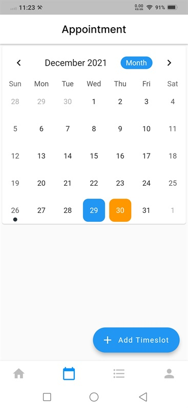
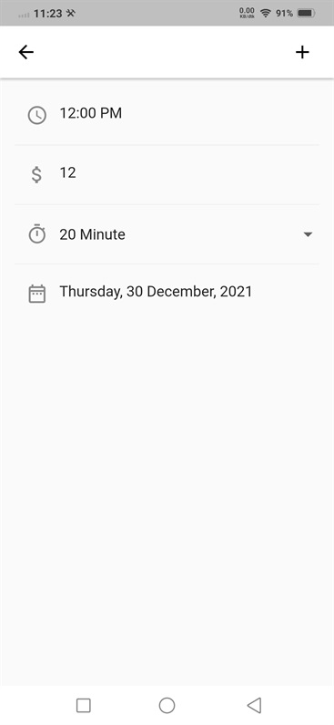
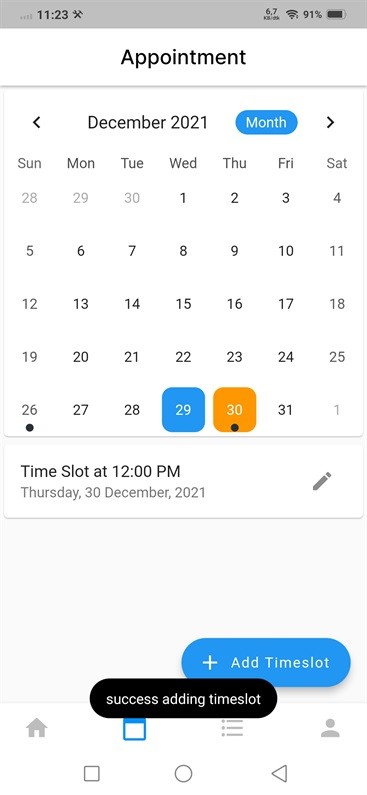

# Testing Video Call Feature

To try to start the video call feature, we have to make a timeslot schedule in the Teacher app, and buy the timeslot in the client app

# 1. Create Timeslot

- after you succesfully run your `Helo Teacher - Teacher App`, you need to register as a Teacher

- after register, click `calendar icon` -> chose date you wan to create timeslot dan press `Add Timeslot`

- Fill in the timeslot creation form -> press `+` at top right corder to add timeslot

- after that your timeslot should be ready to purchase, in the `Helo Teacher - Client App`

# 2. Order the Timeslot

after creating timeslot in `Helo Doctro : Teacher App` we need to order the timeslot in the Client App

- open `Helo Teacher Client App` -> chose the Teacher you wanto consult with

- order the Timeslot, you already create before

# 3. Start Video Call

- after you order timeslot in `Client App` -> now you can start Video Call Session by clicking Start Video Call in `Teacher App` refresh it,
  please refresh if you don't see the order

- in `Client app`, you can now `Join Consultation`

- your Video Call Session should be work
