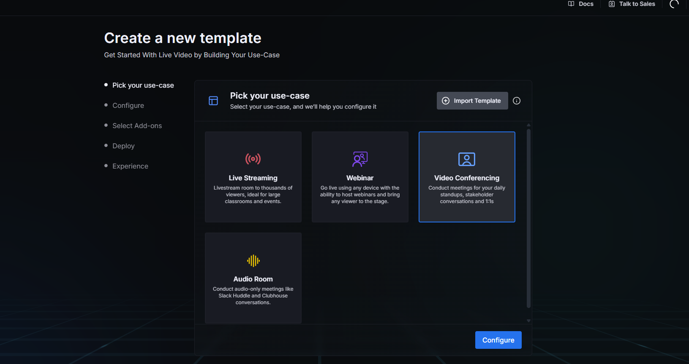
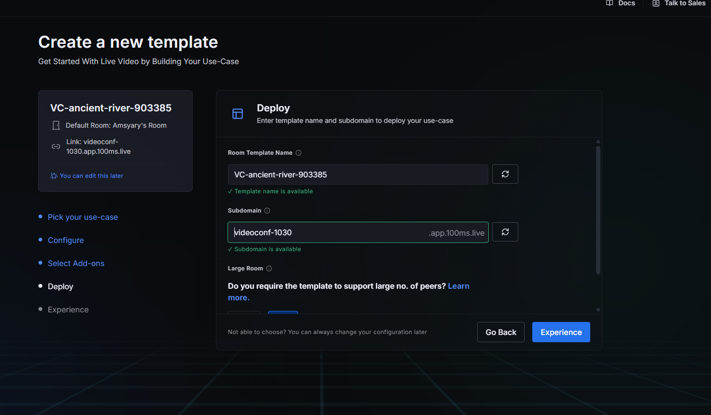
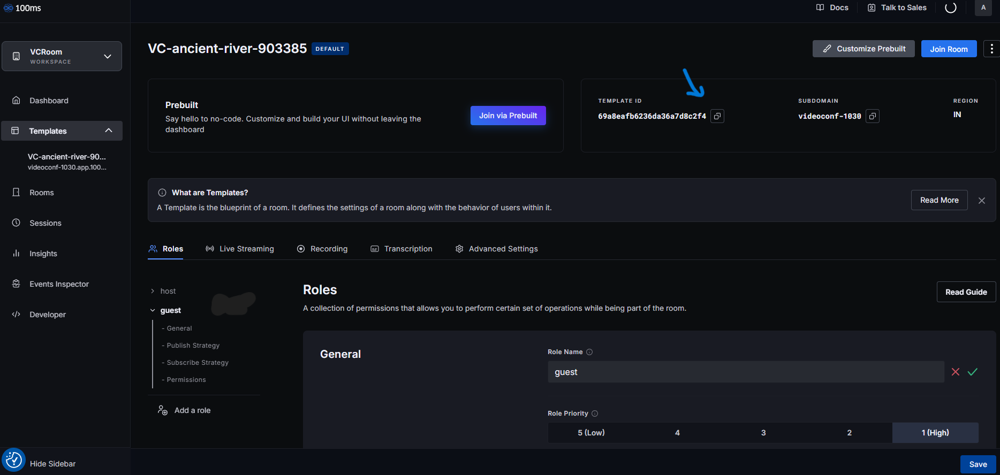
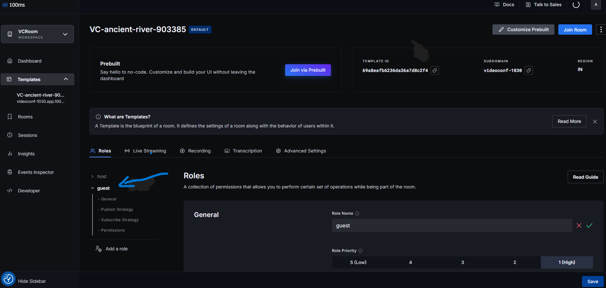
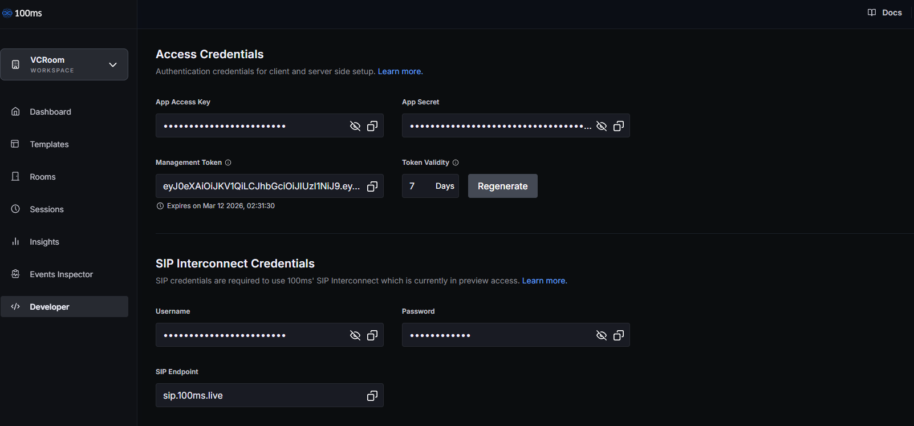
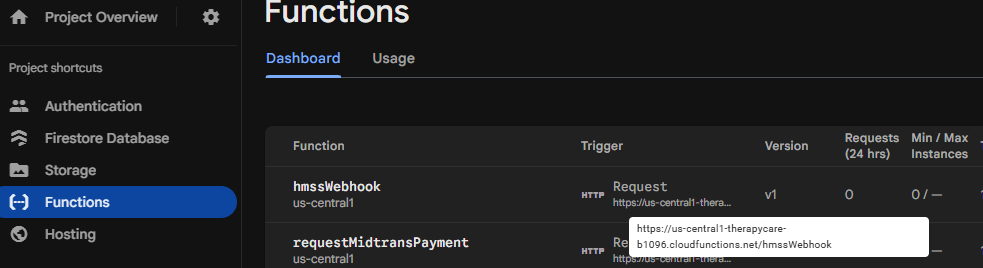
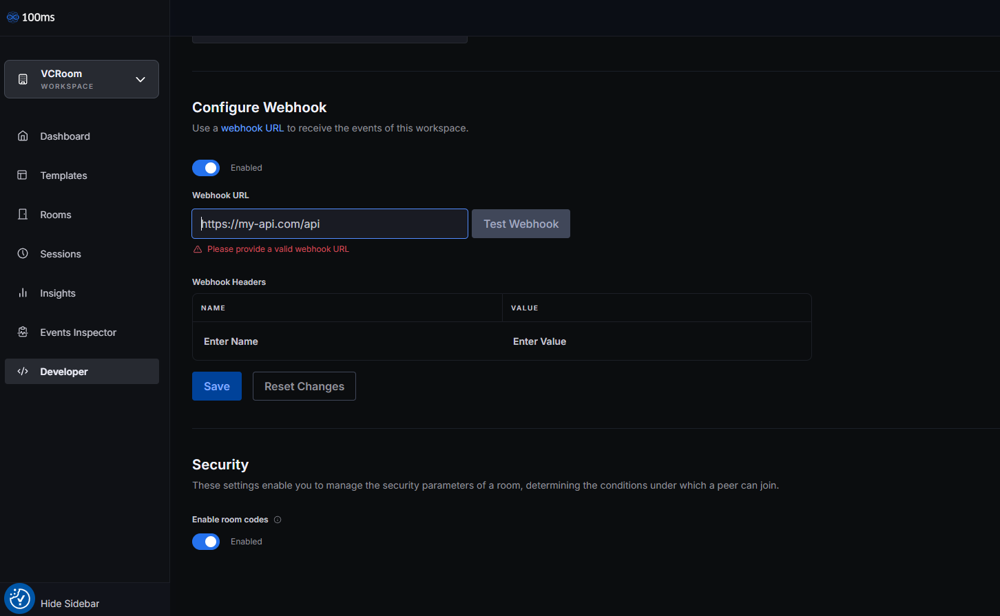

# 100ms for Video Call

## What is 100ms?

[100ms](https://www.100ms.live/) is a video calling provider (SDK + dashboard) that lets you create **rooms**, define **roles** (for example host/guest), generate **join tokens**, and receive **webhooks** for events like session start/end and recordings.

In this project, 100ms is used as the video call provider so teachers and clients can join a video room securely.

## Step 1: Register a 100ms account

1. Open https://www.100ms.live/
2. Register a new account and sign in.

## Step 2: Create workspace (Video conferencing template)

After signing in, 100ms will ask you to create a workspace.

1. Create a new workspace
2. Select the template
3. Choose **Video conferencing**
4. Click **Configure**

## Step 3: Room template name and subdomain

Next, you can configure the room template:

- **Room template name**: you can keep the default
- **Subdomain**: you can keep the default

Then click **Experience**.

## Step 4: Copy Template ID to Cloud Functions env

1. Go back to the 100ms dashboard
2. Open the **Templates** section
3. Copy the **Template ID**

4. Paste it into your **Cloud Functions project** environment file (`.env`), using the variable name that already exists in that project’s `.env_example`.

:::info
This documentation repo does not contain the Cloud Functions source code. Use the variable names from your Cloud Functions project’s `.env_example` to avoid mismatches.
:::

## Step 5: Ensure the `guest` role exists

Still in the **Templates** section:

1. Open the template you created
2. Check roles
3. Make sure there is a role named **guest**
4. If it does not exist, create a new role called **guest**

## Step 6: Copy App Access Key and App Secret to Cloud Functions env

1. Go to the **Developer** section in the 100ms dashboard
2. Copy:
   - **App Access Key**
   - **App Secret**

3. Paste both into your Cloud Functions project `.env` file (again, use the variable names from the project’s `.env_example`).

## Step 7: Setup webhook (required for tracking sessions/recordings)

This project uses a webhook so the backend can track video call sessions (and recordings, if enabled).

1. In the 100ms dashboard, go to **Developer**
2. Scroll down to the **Webhooks** section
3. For the webhook URL, use your Firebase Cloud Functions endpoint:
   - Open **Firebase Console**
   - Go to **Functions**
   - Find the function named **hmssWebhook**
   - Copy its URL
  

1. Paste the URL into the 100ms webhook configuration
2. Save

## Done

After setting the Template ID, roles, app credentials, and webhook, the 100ms video call integration should be ready.
