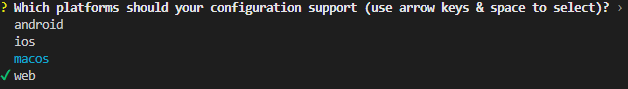
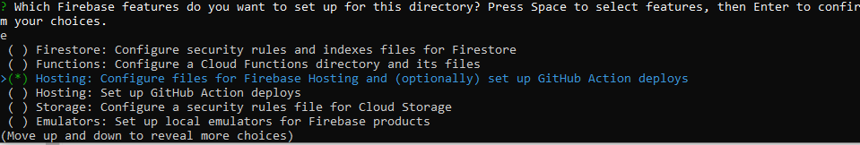
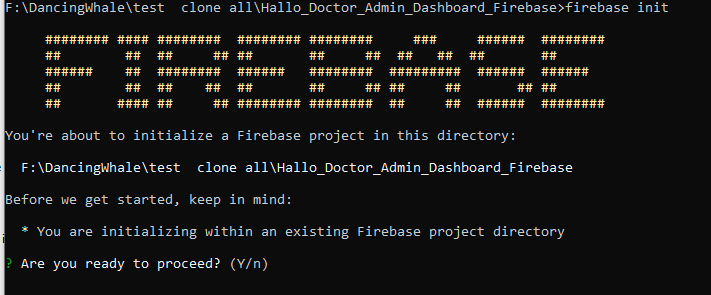
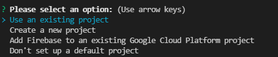

# Setup Web Admin Dashboard

### Prerequisites

Before starting, you need to have the following installed:

- Firebase CLI and logged in (`npm install -g firebase-tools`, then `firebase login`)

## Step 1: Use FlutterFire CLI

1. Open a terminal and navigate to your `/Hello_Teacher_Admin_Dashboard_Flutter` directory, and install all the dependency :
```
flutter pub get
```

2. Run the following command to install the FlutterFire CLI:

   ```
   flutter pub global activate flutterfire_cli
   ```

3. Run the following command to initialize Firebase in your app:

   ```
   flutterfire configure
   ```

4. Choose your Firebase project.

5. Choose the platform you want. In this case, choose `web` by pressing space and using the arrow keys.

   

6. Your admin dashboard is now connected to your Firebase project. To start the project, press `F5` and choose Chrome or deploy it to Firebase hosting. We'll deploy the admin dashboard to Firebase.

7. Build your Flutter app for the web using the following command:

   ```
   flutter build web
   ```

8. After the build is done, initialize Firebase hosting in your Admin Dashboard folder using this command:

   ```
   firebase init
   ```

   

   You'll be asked to choose your Firebase project. Choose the project that you set up previously.

   

   Press Enter.

   You'll be asked to choose which Firebase features to activate in this folder. Choose `Hosting: Configure File for Hosting`.

   

   You'll be asked to enter the name of your public directory folder. Enter `build/web` because the build folder is the default build folder of this Flutter project.

   Answer yes or press Enter to the rest of the questions.

9.  After initializing Firebase, publish it to Firebase hosting using the following command:

   ```
   firebase deploy
   ```

10. You can now open the URL that Firebase gives and log in using your email and password that you previously set up in the `Setup Teacher Category` tab.
